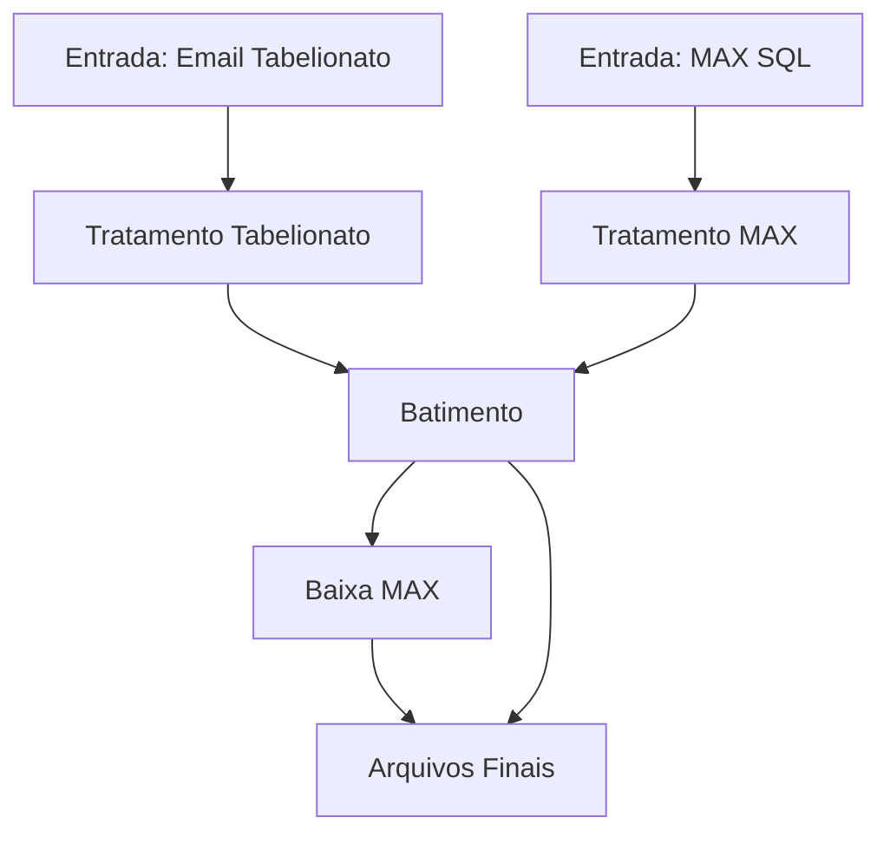

# Pipeline Tabelionato/MAX - Sistema de Processamento de Dados

> **Versao:** 1.0 | **Data:** Outubro 2025 | **Status:** Pronto para producao

Pipeline automatizado para extracao, tratamento e cruzamento entre as bases Tabelionato, MAX e custas. O fluxo integra captura de anexos de e-mail, acesso a banco de dados SQL Server e consolidacao das evidencias de batimento e baixa em um unico pacote operavel.

---

## Requisitos de Sistema (Windows)

- Windows 10 ou 11 (64 bits).
- Permissao para executar scripts PowerShell na primeira execucao (download do Python portavel e `pip`).
- Acesso a internet durante o primeiro uso **ou** pacote embutido do Python extraido manualmente em `bin\python`.
- Microsoft ODBC Driver 18 (ou 17) para SQL Server instalado. Consulte [Instalacao do ODBC Driver SQL Server](#instalacao-do-odbc-driver-sql-server).
- 7-Zip CLI ja acompanha o repositório em `bin\`.

---

## Setup Rapido (Primeira Vez)

```cmd
# 0. (Opcional) Forcar download/validacao do Python portavel
bin\python\ensure_portable_python.cmd

# 1. Preparar ambiente virtual e dependencias
run_tabelionato.bat 1

# 2. Configurar credenciais locais
copy .env.example .env
notepad .env

# 3. Executar o fluxo completo
run_tabelionato.bat 2

# 4. Conferir logs consolidados
notepad data\logs\tabelionato.log
```

> **Nota:** `run_tabelionato.bat` chama automaticamente o helper `bin\python\ensure_portable_python.cmd`. A etapa `#0` e apenas para antecipar o download em estacoes offline ou validar o runtime previamente.

---

## Documentacao Completa
- **Docs/README.md** - Visao geral dos scripts e da estrutura de dados.
- **Docs/Fluxo_atual.md** - Sequencia detalhada das etapas apos os ajustes de 2025.
- **Docs/Referencia/** - Materiais complementares fornecidos pela operacao.

## Instalacao do ODBC Driver SQL Server

### Metodo recomendado (Winget)
1. Abra o PowerShell como Administrador.
2. Execute:
   ```powershell
   winget install --id Microsoft.msodbcsql.18 -e --silent --accept-package-agreements --accept-source-agreements
   ```
3. Valide a presenca do driver:
   ```powershell
   Get-OdbcDriver | Where-Object { $_.Name -like 'ODBC Driver 1* for SQL Server' }
   ```

### Metodo offline (MSI)
1. Baixe o instalador correspondente ao seu sistema:
   - [ODBC Driver 18](https://learn.microsoft.com/sql/connect/odbc/download-odbc-driver-for-sql-server) (arquivo `msodbcsql18.msi`).
   - Alternativamente, utilize o Driver 17 (`msodbcsql17.msi`) caso o 18 nao esteja homologado.
2. Em um Prompt elevado, execute:
   ```cmd
   msiexec /i msodbcsql18.msi IACCEPTMSODBCSQLLICENSETERMS=YES ADDLOCAL=ALL /qn
   ```
   Ajuste o nome do arquivo caso utilize a versao 17.
3. Confirme a instalacao abrindo `odbcad32.exe` (64 bits) e verificando o driver na aba **Drivers**, ou via PowerShell com o comando do passo 3 acima.

> **Dica:** O driver 18 exige TLS 1.2. Se o MAX ainda requer o 17, instale os dois pacotes — ambos podem coexistir.

### Documentacao Tecnica
- **utils/logger_config.py** - Padrao de logging unico para todo o pipeline.
- **utils/sql_conn.py** - Conectores ODBC reutilizaveis para SQL Server.
- **utils/queries_tabelionato.py** - Consultas SQL parametrizadas utilizadas na extracao MAX.
- **utils/validacao_resultados.py** - Auxiliares para conferencias de chaves e totais.
- **CHANGELOG_fixes.md** - Historico das correcoes aplicadas nos scripts em lote.

### Historico de Correcoes
- Consulte `CHANGELOG_fixes.md` para ajustes recentes em `run_tabelionato.bat` e `fluxo_completo.bat`.

---

## Scripts Disponiveis

| Script | Descricao | Quando usar |
|--------|-----------|-------------|
| `run_tabelionato.bat` | Menu interativo (instalacao, extracoes, tratamentos, batimento e baixa) | Operacao diaria e execucao guiada |
| `fluxo_completo.bat` | Wrapper que garante `.venv` pronto e chama `fluxo_completo.py` | Agendamentos e execucao direta do fluxo completo |
| `fluxo_completo.py` | Orquestrador Python das seis etapas principais | Execucao manual dentro do `.venv` ou integracao CI |
| `extracao_base_max_tabelionato.py` | Extrai dados MAX via SQL Server | Atualizar base MAX isoladamente |
| `extrair_base_tabelionato.py` | Baixa anexos de cobranca e custas do e-mail | Renovar entradas por e-mail sem refazer todo o pipeline |
| `tratamento_max.py` | Normaliza e valida a base MAX | Reprocessar apenas MAX apos ajustes |
| `tratamento_tabelionato.py` | Normaliza a base Tabelionato e calcula campanhas | Reprocessar apenas Tabelionato |
| `batimento_tabelionato.py` | Gera pendencias, campanhas e enriquecimento | Revisar divergencias sem executar baixa |
| `baixa_tabelionato.py` | Identifica protocolos ausentes na MAX e gera baixa | Alimentar sistemas de cobranca |
| `src\utils\console.py` | Helpers para formatar saída e silenciar logs no console | Garantir relatorios compactos em execucoes interativas/automatizadas |
| `tests\teste_procv.py` | Ferramenta interativa de comparacao de bases | Auditorias e validacao de evidencias |

---

## Fluxo Completo Tabelionato (Recomendado)

1. Extracao MAX direta do SQL Server.
2. Extracao dos anexos de cobranca e custas via IMAP com 7-Zip embarcado (a ferramenta detecta `bin\7z.exe` ou `bin\7_zip_rar\7-Zip\7z.exe` antes de reextrair o pacote e imprime um resumo com email/anexos/contagens).
3. Tratamento MAX (padronizacao, validacao e consolidacao).
4. Tratamento Tabelionato (normalizacao, campanhas 14/58 e aging).
5. Batimento MAX x Tabelionato com enriquecimento adicional (console mostra apenas contagens e arquivos gerados).
6. Baixa MAX com incorporacao das custas e geracao de relatorio final.

### Vantagens do Fluxo
- Cobertura ponta a ponta sem intervencao manual entre as etapas.
- Validacoes e logs ASCII compartilhados para auditoria.
- Arquivos finais gerados em ZIP prontos para sistemas legados.
- Ambiente virtual autocontido (.venv) evita conflitos de dependencia.

### Comparacao de Modos de Execucao

| Aspecto | Fluxo completo (opcao 2) | Execucao por etapas |
|---------|--------------------------|---------------------|
| Abrangencia | Extracao, tratamentos, batimento e baixa | Etapas isoladas conforme necessidade |
| Tempo medio | Aproximadamente 3-4 minutos com extracoes habilitadas | Variavel (depende das etapas escolhidas) |
| Dependencias | Automatiza criacao do `.venv` e instala pacotes | Requer `run_tabelionato.bat 1` previo |
| Uso recomendado | Produzir arquivos oficiais para entrega | Testes, reprocessamentos pontuais |

---

## Visao Geral

Sistema automatizado que:
- Extrai anexos de cobranca e custas do e-mail corporativo.
- Consulta o banco MAX via ODBC.
- Trata, higieniza e sincroniza chaves entre as fontes.
- Identifica pendencias (campanhas 14 e 58) e oportunidades de baixa.
- Consolida logs e relatorios zipados na pasta `data/output/`.

---

## Arquitetura do Sistema

### Estrutura de Diretorios

```
Tabelionato1-1/
|-- .venv/                  Ambiente virtual isolado
|-- bin/                    Utilitarios embarcados (7-Zip CLI)
|-- data/
|   |-- input/              Arquivos brutos (MAX, cobranca, custas)
|   |-- output/             Resultados tratados, batimento e baixa
|   `-- log/                Log consolidado (tabelionato.log)
|-- Docs/                   Documentacao de apoio
|-- utils/                  Modulos compartilhados (SQL, logging)
|-- tests/                  Ferramentas de validacao (teste_procv)
|-- fluxo_completo.py       Orquestrador principal
|-- fluxo_completo.bat      Wrapper para execucao automatica
|-- run_tabelionato.bat     Menu interativo e automacoes
`-- *.py                    Etapas individuais do pipeline
```

### Fluxo de Processamento



---

## Requisitos e Instalacao

### Requisitos do Sistema

| Componente | Versao minima | Observacao |
|------------|---------------|------------|
| Python | 3.11 | Runtime portavel baixado automaticamente pelo instalador |
| ODBC Driver | 17 | Conexao com SQL Server MAX |
| 7-Zip CLI | 16.04 | Versao embarcada em `bin/7z.exe` |
| Sistema Operacional | Windows 10 | Ambiente oficial de execucao |

### Instalacao Rapida (Windows)

```cmd
:: 1. Clonar ou atualizar o repositorio
cd C:\Users\%USERNAME%\Desktop

:: 2. Preparar o ambiente
run_tabelionato.bat 1

:: 3. Configurar credenciais
copy .env_exemplo .env
notepad .env
```

### Linux/macOS (execucao parcial via WSL)

```bash
python3 -m venv .venv
source .venv/bin/activate
pip install -r requirements.txt
python fluxo_completo.py --skip-extraction
```

---

## Configuracao de Credenciais

Crie um arquivo `.env` com base em `.env_exemplo`.

```env
# Email IMAP
EMAIL_USER=usuario@empresa.com
EMAIL_APP_PASSWORD=senha_app
IMAP_SERVER=imap.gmail.com
EMAIL_SUBJECT_KEYWORD=Candiotto
EMAIL_SUBJECT_TOKENS=base de dados;tabelionato;relatorio de recebimento de custas

# SQL Server MAX
MSSQL_SERVER_STD=servidor.database.windows.net
MSSQL_DATABASE_STD=banco
MSSQL_USER_STD=usuario
MSSQL_PASSWORD_STD=senha

# Opcional 7-Zip
SEVEN_ZIP_PATH=C:\\Program Files\\7-Zip\\7z.exe
```

> O arquivo `.env` nao deve ser versionado. Utilize canais seguros para compartilhar credenciais.

### Validacao Rapida

```cmd
:: Ativar o ambiente virtual
call .\.venv\Scripts\activate.bat

:: Verificar dependencias instaladas
python -m pip list

:: Checar entrada do orquestrador
python fluxo_completo.py --help
```

---

## Principais Melhorias Recentes

1. **Scripts em lote resilientes**: `run_tabelionato.bat` agora usa `VENV_PYTHON` de forma consistente e apresenta feedback visual durante a instalacao de dependencias.
2. **Fluxo completo autonomo**: `fluxo_completo.bat` cria `.venv`, instala requisitos e executa o orquestrador automaticamente, reduzindo falhas por ambiente nao preparado.
3. **Logs ASCII unificados**: todos os modulos Python compartilham `utils/logger_config.py`, gerando `data/logs/tabelionato.log` com mensagens legiveis em consoles Windows.
4. **Tratamentos alinhados**: scripts de tratamento e batimento produzem sempre os mesmos nomes de arquivos, simplificando integra??es e auditorias.

---

## Guia de Uso

### Execucao Automatica (Producao)

```cmd
cmd /c ""C:\Users\Thiago\Desktop\Versoes finais\Automacao_Tabelionato\run_tabelionato.bat" 2"
```

- Verifica dependencias.
- Extrai MAX e anexos do e-mail.
- Processa tratamentos, batimento e baixa.
- Consolida resultados em `data/output/` e logs em `data/logs/`.

### Menu Interativo (Desenvolvimento)

```cmd
run_tabelionato.bat
```

Selecione a opcao desejada conforme tabela exibida pelo menu (1 a 9).

### Execucao via CLI (Avancado)

```cmd
:: Dentro do .venv
.\.venv\Scripts\python.exe tratamento_max.py
.\.venv\Scripts\python.exe tratamento_tabelionato.py
.\.venv\Scripts\python.exe batimento_tabelionato.py
```

Use `python fluxo_completo.py --skip-extraction` para reaproveitar arquivos ja extraidos.

---

## Resultados Esperados (Execucao Completa)

| Etapa | Registros processados | Arquivo gerado |
|-------|-----------------------|----------------|
| MAX tratado | ~212.000 | `data/output/max_tratada/max_tratada.zip`
| Tabelionato tratado | ~231.000 | `data/output/tabelionato_tratada/tabelionato_tratado.zip`
| Batimento campanha 14 | ~12.000 | `data/output/batimento/batimento_campanha14.zip`
| Batimento campanha 58 | ~12.000 | `data/output/batimento/batimento_campanha58.zip`
| Enriquecimento | dezenas | `data/output/batimento/tabela_enriquecimento.zip`
| Baixa | ~30-40 | `data/output/baixa/baixa_tabelionato_YYYYMMDD_HHMMSS.zip`
| Inconsistencias MAX | variavel | `data/output/inconsistencias/max_inconsistencias.zip`
| Inconsistencias Tabelionato | variavel | `data/output/inconsistencias/tabelionato_inconsistencias.zip`

> Os valores foram obtidos na execucao de 05/10/2025 e servem como referencia para detectar desvios.

---

## Monitoramento e Logs

```cmd
:: Acompanhar log em tempo real
Get-Content data\logs\tabelionato.log -Wait

:: Listar arquivos finais
powershell -Command "Get-ChildItem data\output -Recurse | Where-Object { -not $_.PSIsContainer }"
```

- Logs seguem formato ASCII e reiniciam automaticamente se o arquivo for removido.
- Mensagens de erro exibem codigos de saida especificos nos scripts em lote.

---

## Extracao de Dados

```cmd
:: Extrair apenas MAX
run_tabelionato.bat 3

:: Extrair apenas anexos de e-mail
run_tabelionato.bat 4
```

Arquivos sao salvos em `data/input/max/` e `data/input/tabelionato/`.

---

## Troubleshooting

- **Python nao encontrado**: execute `bin\python\ensure_portable_python.cmd` para baixar o runtime portavel ou instale Python 3.11+ manualmente e mantenha `python` no PATH.
- **Falha ao acessar IMAP**: valide usuario, senha de app e servidor no `.env`.
- **7-Zip indisponivel**: confirme `bin/7z.exe` ou ajuste `SEVEN_ZIP_PATH`.
- **Conexao SQL falhou**: verifique ODBC Driver 17 e credenciais MAX.
- **Arquivos antigos interferindo**: utilize `run_tabelionato.bat 9` para limpar saidas e log antes de novo processamento.
- **Ambiente corrompido**: remova `.venv` e rode `run_tabelionato.bat 1` novamente.

---

## Diagnostico Automatizado

1. Execute `run_tabelionato.bat 1` para validar instalacao de dependencias.
2. Rode `python -m compileall fluxo_completo.py batimento_tabelionato.py baixa_tabelionato.py` para verificar sintaxe.
3. Utilize `tests\teste_procv.py` para comparar determinadas chaves entre arquivos gerados e referencias externas.

---

## Documentacao Tecnica Complementar

| Recurso | Descricao |
|---------|-----------|
| `Docs/Fluxo_atual.md` | Detalhes das etapas e scripts acionados pelo menu.
| `Docs/README.md` | Inventario de scripts, dados e funcionalidades.
| `CHANGELOG_fixes.md` | Registro das alteracoes recentes.

---

## Desenvolvimento e Contribuicao

```cmd
git clone <url>
cd Tabelionato1-1
python -m venv .venv
.\.venv\Scripts\activate
pip install -r requirements.txt
```

- Utilize pandas + numpy conforme `requirements.txt`.
- Mantenca mensagens de commit em portugues objetivo.
- Respeite os nomes padrao de saida para preservar compatibilidade com os lotes existentes.

---

## Checklist de Entrega

- Codigo fonte organizado em `*.py` e scripts `.bat` atualizados.
- Ambiente virtual reconstruivel via `requirements.txt`.
- Documentacao revisada (`README.md`, `Docs/`).
- `.env_exemplo` atualizado com todas as variaveis necessarias.
- `data/input/` e `data/output/` limpos antes de compartilhar o pacote.

---

## Estrutura de Entrega

```
Tabelionato1-1/
|-- README.md
|-- requirements.txt
|-- .env_exemplo
|-- run_tabelionato.bat
|-- fluxo_completo.bat
|-- fluxo_completo.py
|-- baixa_tabelionato.py
|-- batimento_tabelionato.py
|-- tratamento_max.py
|-- tratamento_tabelionato.py
|-- extracao_base_max_tabelionato.py
|-- extrair_base_tabelionato.py
|-- data/
|-- Docs/
|-- utils/
|-- tests/
`-- bin/
```

---

## Para Comecar

1. Clonar ou atualizar o repositorio.
2. Criar `.env` a partir de `.env_exemplo`.
3. Executar `run_tabelionato.bat 1`.
4. Rodar `run_tabelionato.bat 2`.
5. Validar geracoes em `data/output/` e o log consolidado.

---

## Suporte e Contato

- Registre duvidas ou melhorias via issues do repositorio.
- Centralize comunicacoes operacionais no canal oficial da equipe Tabelionato.
