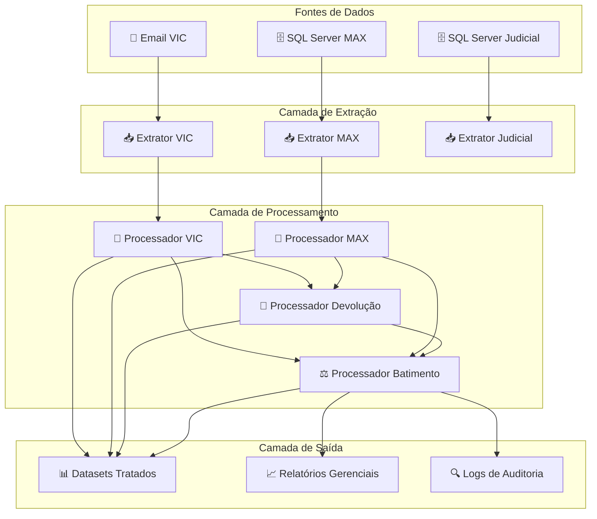
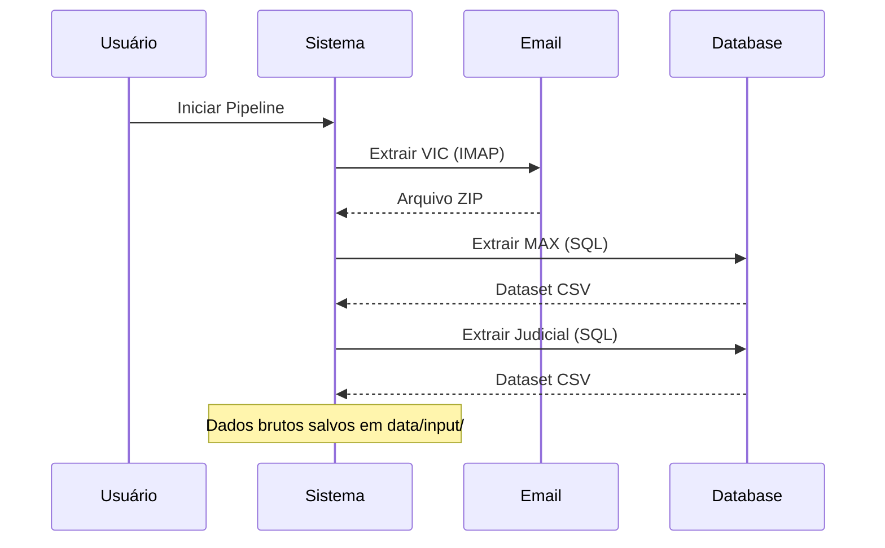
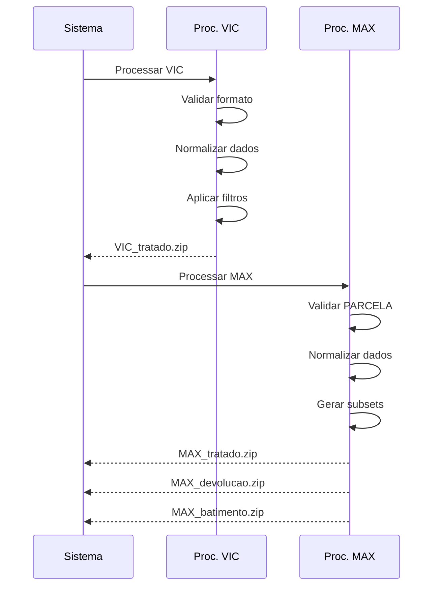
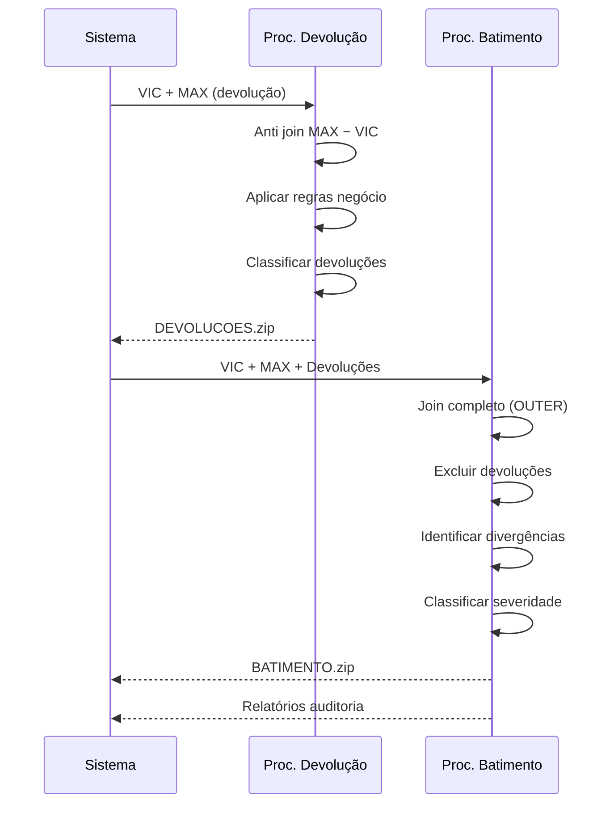

# Arquitetura do Sistema - Pipeline VIC/MAX

## 📋 Visão Geral

O **Pipeline VIC/MAX** é um sistema de processamento de dados financeiros que automatiza a extração, tratamento, devolução e auditoria de informações de cobrança. O sistema é composto por quatro processadores principais que trabalham em sequência para garantir a integridade e consistência dos dados.

## 🏗️ Arquitetura Geral



## 🔄 Fluxo de Processamento

### Fase 1: Extração de Dados



### Fase 2: Processamento Individual



### Fase 3: Processamento Cruzado



## 🧩 Componentes do Sistema

### 1. Processador VIC

**Responsabilidade:** Tratamento de dados extraídos por email

**Entrada:**
- Arquivos ZIP anexados em emails
- Formato: CSV com dados de cobrança

**Processamento:**
- Validação de formato de arquivo
- Normalização de CPF/CNPJ
- Filtros por status (`EM ABERTO`, `VENCIDO`)
- Validação de datas de vencimento
- Remoção de duplicatas

**Saída:**
- `VIC_tratado_YYYYMMDD_HHMMSS.zip`
- `VIC_inconsistencias_YYYYMMDD_HHMMSS.csv`
- `VIC_estatisticas_YYYYMMDD_HHMMSS.json`

**Métricas Típicas:**
- 400k-500k registros processados
- 95%+ taxa de aproveitamento
- Filtros reduzem ~20% dos dados

### 2. Processador MAX

**Responsabilidade:** Tratamento de dados extraídos do MaxSmart

**Entrada:**
- Dados SQL do sistema MaxSmart
- Formato: CSV com informações de campanha

**Processamento:**
- Validação rigorosa de formato `PARCELA`
- Normalização de documentos
- Geração de subsets específicos
- Análise de qualidade dos dados

**Saída:**
- `MAX_tratada_YYYYMMDD_HHMMSS.zip` (completo)
- `MAX_devolucao_YYYYMMDD_HHMMSS.zip` (filtrado)
- `MAX_batimento_YYYYMMDD_HHMMSS.zip` (amplo)
- `MAX_inconsistencias_YYYYMMDD_HHMMSS.csv`

**Métricas Típicas:**
- 2M+ registros processados
- 98%+ parcelas com formato válido
- 3 datasets especializados gerados

### 3. Processador de Devolução

**Responsabilidade:** Identificação de parcelas para devolução

**Entrada:**
- `VIC_tratado_*.zip`
- `MAX_devolucao_*.zip`

**Processamento:**
- Anti join MAX − VIC (parcelas no MAX ausentes no VIC)
- Aplicação de regras de negócio
- Classificação por motivo e prioridade
- Cálculo de métricas financeiras

**Saída:**
- `DEVOLUCOES_YYYYMMDD_HHMMSS.zip`
- `DEVOLUCOES_ALTA_YYYYMMDD_HHMMSS.csv`
- `DEVOLUCOES_MEDIA_YYYYMMDD_HHMMSS.csv`
- `DEVOLUCOES_BAIXA_YYYYMMDD_HHMMSS.csv`
- `RELATORIO_DEVOLUCOES_YYYYMMDD_HHMMSS.txt`

**Métricas Típicas:**
- 20-30% das parcelas do MAX geram devolução (anti join)
- 250k-300k devoluções identificadas
- R$ 200M+ em valor de devoluções

### 4. Processador de Batimento

**Responsabilidade:** Auditoria e reconciliação final

**Entrada:**
- `VIC_tratado_*.zip`
- `MAX_batimento_*.zip`
- `DEVOLUCOES_*.zip`

**Processamento:**
- Join OUTER completo
- Exclusão de devoluções
- Identificação de divergências
- Classificação por severidade
- Geração de relatórios de auditoria

**Saída:**
- `batimento_vic_YYYYMMDD_HHMMSS.zip` (contém: batimento_judicial.csv, batimento_extrajudicial.csv)
- `BATIMENTO_CRITICA_YYYYMMDD_HHMMSS.csv`
- `RELATORIO_AUDITORIA_YYYYMMDD_HHMMSS.txt`
- `METRICAS_BATIMENTO_YYYYMMDD_HHMMSS.json`

**Métricas Típicas:**
- 2M+ registros analisados
- 15-20% taxa de match entre sistemas
- 15-20% registros requerem ação

## 📊 Fluxo de Dados

### Estrutura de Diretórios

```
data/
├── input/                          # Dados brutos extraídos
│   ├── vic/                        # Arquivos ZIP do email
│   ├── max/                        # Dados SQL MaxSmart
│   └── judicial/                   # Dados SQL Judicial
├── output/                         # Dados processados
│   ├── vic/                        # Saídas do processador VIC
│   ├── max/                        # Saídas do processador MAX
│   ├── devolucao/                  # Saídas do proc. devolução
│   └── batimento/                  # Saídas do proc. batimento
└── logs/                           # Logs estruturados
    ├── vic_YYYYMMDD.log
    ├── max_YYYYMMDD.log
    ├── devolucao_YYYYMMDD.log
    └── batimento_YYYYMMDD.log
```

### Convenções de Nomenclatura

```python
# Padrão geral: TIPO_SUBTIPO_YYYYMMDD_HHMMSS.extensao

# Exemplos:
VIC_tratado_20240115_142030.zip
MAX_devolucao_20240115_143025.zip
DEVOLUCOES_20240115_144530.zip
batimento_vic_20240115_145530.zip

# Relatórios:
RELATORIO_DEVOLUCOES_20240115_144530.txt
RELATORIO_AUDITORIA_20240115_145530.txt

# Métricas:
VIC_estatisticas_20240115_142030.json
METRICAS_BATIMENTO_20240115_145530.json
```

## ⚙️ Configuração Centralizada

### Arquivo config.yaml

```yaml
# Configuração global do pipeline
global:
  timezone: 'America/Sao_Paulo'
  encoding: 'utf-8'
  date_format: '%Y%m%d_%H%M%S'
  
# Configurações por processador
vic:
  filtros:
    status_validos: ['EM ABERTO', 'VENCIDO']
    dias_vencimento_max: 1095  # 3 anos
  validacao:
    cpf_obrigatorio: true
    valor_minimo: 0.01

max:
  validacao:
    regex_parcela: '^\\d{4,6}-\\d{2,3}$'
    max_inconsistencias_percent: 5.0
  devolucao:
    status_aceitos: ['ATIVO']
    campanha_termo: '2024'
  batimento:
    status_aceitos: ['ATIVO', 'PENDENTE']

devolucao:
  regras:
    tolerancia_valor_percent: 5.0
    campanhas_ativas: ['2024_JAN', '2024_FEV']
    dias_vencimento_max: 90
  classificacao:
    limite_prioridade_alta_valor: 10000.0

batimento:
  tolerancias:
    valor_absoluta: 0.01
    valor_percentual: 0.1
  severidade:
    valor_critico: 50000.0
    valor_alto: 10000.0
```

## 🔍 Sistema de Logging

### Estrutura de Logs

```python
# Formato padrão:
# TIMESTAMP | NIVEL | PROCESSADOR | METRICA: VALOR | DETALHES

# Exemplos:
2024-01-15 14:20:30 | INFO | VIC | Registros carregados: 459.339
2024-01-15 14:21:45 | INFO | VIC | Após filtro STATUS=EM ABERTO: 387.234 (84.3%)
2024-01-15 14:30:25 | INFO | MAX | Parcelas formato válido: 2.298.456 (98.0%)
2024-01-15 14:45:30 | INFO | DEVOLUCAO | Anti join MAX − VIC: 387.234 registros (15.7%)
2024-01-15 14:55:30 | INFO | BATIMENTO | Divergências críticas: 12.345 (0.6%)

# Warnings e erros:
2024-01-15 14:22:15 | WARNING | VIC | 1.234 duplicatas removidas (0.3%)
2024-01-15 14:31:10 | ERROR | MAX | Coluna PARCELA não encontrada
```

### Níveis de Log

- **DEBUG:** Informações técnicas detalhadas
- **INFO:** Progresso normal e métricas
- **WARNING:** Situações que requerem atenção
- **ERROR:** Erros que param o processamento
- **CRITICAL:** Falhas críticas do sistema

## 📈 Métricas e KPIs

### Métricas por Processador

#### VIC
- Taxa de aproveitamento: 95%+
- Registros processados: 400k-500k
- Tempo de processamento: 2-3 min
- Duplicatas encontradas: <1%

#### MAX
- Taxa de parcelas válidas: 98%+
- Registros processados: 2M+
- Tempo de processamento: 5-8 min
- Datasets gerados: 3

#### Devolução
- Taxa de match VIC ⟵⟶ MAX: 70-80%
- Devoluções identificadas: 250k-300k
- Valor total devoluções: R$ 200M+
- Tempo de processamento: 3-5 min

#### Batimento
- Taxa de match geral: 15-20%
- Divergências críticas: <1%
- Registros que requerem ação: 15-20%
- Tempo de processamento: 8-12 min

### KPIs de Qualidade

```python
# Qualidade dos dados
qualidade_vic = (registros_validos / registros_totais) * 100
qualidade_max = (parcelas_validas / parcelas_totais) * 100

# Eficiência do processo
eficiencia_devolucao = (devolucoes_identificadas / matches_possiveis) * 100
eficiencia_batimento = (divergencias_resolvidas / divergencias_totais) * 100

# Performance do sistema
performance = tempo_total_processamento / volume_dados_gb
```

## 🔒 Segurança e Compliance

### Proteção de Dados

- **Criptografia:** Dados sensíveis em repouso
- **Anonimização:** CPF/CNPJ em logs (parcial)
- **Auditoria:** Trilha completa de processamento
- **Backup:** Retenção de 90 dias

### Controles de Acesso

- **Credenciais:** Arquivo `.env` não versionado
- **Logs:** Acesso restrito a administradores
- **Dados:** Segregação por ambiente
- **APIs:** Autenticação obrigatória

## 🚀 Deployment e Operação

### Ambientes

```yaml
# Desenvolvimento
dev:
  database: dev_maxsmart
  email: dev@empresa.com
  volume_esperado: 10k registros
  
# Homologação
hom:
  database: hom_maxsmart
  email: hom@empresa.com
  volume_esperado: 100k registros
  
# Produção
prod:
  database: prod_maxsmart
  email: prod@empresa.com
  volume_esperado: 2M+ registros
```

### Monitoramento

```python
# Alertas automáticos
if taxa_aproveitamento < 90:
    enviar_alerta("Taxa de aproveitamento baixa")
    
if tempo_processamento > limite_sla:
    enviar_alerta("SLA de processamento excedido")
    
if divergencias_criticas > limite_aceitavel:
    enviar_alerta("Muitas divergências críticas")
```

## 🔧 Manutenção e Evolução

### Rotinas de Manutenção

- **Diária:** Limpeza de logs antigos
- **Semanal:** Análise de performance
- **Mensal:** Revisão de configurações
- **Trimestral:** Auditoria de segurança

### Roadmap de Melhorias

1. **Dashboard em Tempo Real**
   - Métricas live
   - Alertas visuais
   - Histórico de execuções

2. **Processamento Paralelo**
   - Múltiplos workers
   - Distribuição de carga
   - Redução de tempo total

3. **Machine Learning**
   - Detecção de anomalias
   - Predição de divergências
   - Otimização automática

4. **API REST**
   - Integração externa
   - Consultas em tempo real
   - Webhooks para notificações

## 📚 Documentação Técnica

### Documentos Disponíveis

- **README.md:** Visão geral e guia de uso
- **ARCHITECTURE_OVERVIEW.md:** Este documento
- **[FLUXO.md](FLUXO.md):** Fluxo completo e dependências do pipeline
- **VIC_PROCESSOR.md:** Documentação específica do VIC
- **MAX_PROCESSOR.md:** Documentação específica do MAX
- **DEVOLUCAO_PROCESSOR.md:** Documentação da devolução
- **BATIMENTO_PROCESSOR.md:** Documentação do batimento
- **LOGS_SPECIFICATION.md:** Especificação de logs


### Padrões de Código

```python
# Estrutura padrão de processador
class ProcessadorBase:
    def __init__(self, config):
        self.config = config
        self.logger = setup_logger()
    
    def carregar_dados(self):
        """Carrega dados de entrada"""
        pass
    
    def processar(self):
        """Lógica principal de processamento"""
        pass
    
    def salvar_resultados(self):
        """Salva dados processados"""
        pass
    
    def gerar_metricas(self):
        """Gera métricas de processamento"""
        pass
```

## 🎯 Conclusão

O Pipeline VIC/MAX é um sistema robusto e escalável que automatiza o processamento de dados financeiros com alta qualidade e auditabilidade. A arquitetura modular permite fácil manutenção e evolução, enquanto o sistema de logging e métricas garante transparência e controle operacional.

### Benefícios Principais

- **Automação:** Reduz trabalho manual em 90%+
- **Qualidade:** Garante consistência dos dados
- **Auditoria:** Trilha completa de processamento
- **Escalabilidade:** Processa milhões de registros
- **Flexibilidade:** Configuração adaptável
- **Confiabilidade:** Tratamento robusto de erros

### Próximos Passos

1. Implementar dashboard de monitoramento
2. Adicionar testes automatizados
3. Otimizar performance para volumes maiores
4. Expandir para outros tipos de dados
5. Integrar com sistemas externos