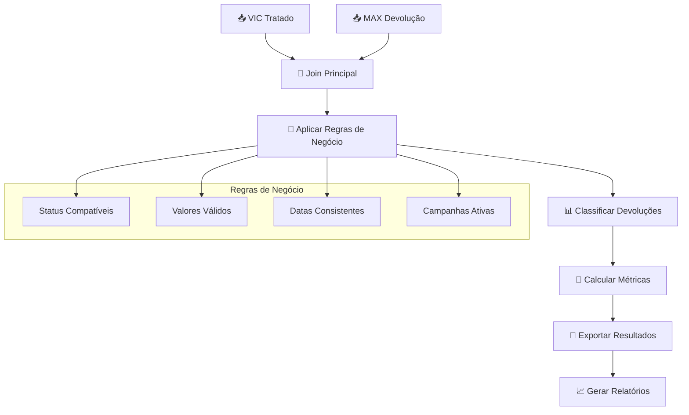

# Processador de Devolução - Documentação Técnica

## 📋 Visão Geral

O **Processador de Devolução** é responsável pelo cruzamento entre dados VIC e MAX para identificar parcelas que devem ser devolvidas ao cliente. Este processador implementa a lógica de negócio central do pipeline, realizando joins complexos e aplicando regras específicas de devolução.

## 🔄 Fluxo de Processamento



## 📊 Estrutura de Dados

### Dados de Entrada

#### VIC (Entrada Principal)
| Coluna | Tipo | Descrição | Exemplo |
|--------|------|-----------|----------|
| `CHAVE` | String | Chave de join (PARCELA) | `12345-001` |
| `CPF_CNPJ` | String | Documento normalizado | `12345678901` |
| `NOME` | String | Nome do cliente | `João Silva` |
| `STATUS` | String | Status VIC | `EM ABERTO` |
| `VALOR_ORIGINAL` | Float | Valor original da dívida | `2500.00` |
| `DATA_VENCIMENTO` | Date | Data de vencimento | `2024-01-15` |

#### MAX (Entrada Secundária)
| Coluna | Tipo | Descrição | Exemplo |
|--------|------|-----------|----------|
| `PARCELA` | String | Chave de join | `12345-001` |
| `CPF_CNPJ_NORMALIZADO` | String | Documento normalizado | `12345678901` |
| `STATUS` | String | Status MAX | `ATIVO` |
| `CAMPANHA` | String | Campanha ativa | `2024_JAN` |
| `VALOR_DIVIDA` | Float | Valor atual da dívida | `2500.00` |

### Dados de Saída

#### Devoluções Identificadas
| Coluna | Tipo | Descrição | Origem |
|--------|------|-----------|--------|
| `CHAVE` | String | Identificador único | VIC |
| `CPF_CNPJ` | String | Documento do cliente | VIC |
| `NOME` | String | Nome do cliente | VIC |
| `STATUS_VIC` | String | Status no VIC | VIC |
| `STATUS_MAX` | String | Status no MAX | MAX |
| `VALOR_VIC` | Float | Valor no VIC | VIC |
| `VALOR_MAX` | Float | Valor no MAX | MAX |
| `DIFERENCA_VALOR` | Float | Diferença entre valores | Calculado |
| `CAMPANHA` | String | Campanha MAX | MAX |
| `MOTIVO_DEVOLUCAO` | String | Razão da devolução | Calculado |
| `PRIORIDADE` | String | Prioridade de devolução | Calculado |

## 🔧 Etapas Detalhadas

### 1. Carregamento dos Datasets

```python
def carregar_datasets_devolucao():
    """
    Carrega datasets VIC e MAX preparados pelos processadores anteriores.
    
    Arquivos esperados:
    - VIC_tratado_*.zip (do processador VIC)
    - MAX_devolucao_*.zip (do processador MAX)
    
    Validações:
    - Presença dos arquivos
    - Colunas obrigatórias
    - Consistência de tipos
    """
    # Localizar arquivos mais recentes
    arquivo_vic = encontrar_arquivo_mais_recente('data/output/vic_tratada', 'VIC_tratado_*.zip')
    arquivo_max = encontrar_arquivo_mais_recente('data/output/max_tratada', 'MAX_devolucao_*.zip')
    
    if not arquivo_vic or not arquivo_max:
        raise FileNotFoundError("Arquivos VIC ou MAX não encontrados")
    
    # Carregar datasets
    df_vic = pd.read_csv(arquivo_vic, compression='zip')
    df_max = pd.read_csv(arquivo_max, compression='zip')
    
    return df_vic, df_max
```

**Logs Gerados:**
```
DEVOLUCAO: Carregando VIC_tratado_20240115_142030.zip
DEVOLUCAO: 459.339 registros VIC carregados
DEVOLUCAO: Carregando MAX_devolucao_20240115_143025.zip
DEVOLUCAO: 1.234.560 registros MAX carregados
```

### 2. Join Principal (VIC ⟵⟶ MAX)

```python
def realizar_join_principal(df_vic, df_max, config):
    """
    Realiza join entre VIC e MAX usando CHAVE/PARCELA.
    
    Tipos de join configuráveis:
    - 'inner': Apenas registros presentes em ambos
    - 'left': Todos VIC + matches MAX
    - 'outer': Todos registros de ambos
    
    Configuração padrão: 'inner' (apenas matches)
    
    Validações pós-join:
    - Consistência de CPF/CNPJ
    - Valores não nulos em colunas críticas
    """
    tipo_join = config.get('devolucao', {}).get('tipo_join', 'inner')
    
    # Realizar join
    df_joined = pd.merge(
        df_vic,
        df_max,
        left_on='CHAVE',
        right_on='PARCELA',
        how=tipo_join,
        suffixes=('_VIC', '_MAX')
    )
    
    # Validar consistência de CPF/CNPJ
    inconsistencias_cpf = df_joined[
        df_joined['CPF_CNPJ'] != df_joined['CPF_CNPJ_NORMALIZADO']
    ]
    
    if len(inconsistencias_cpf) > 0:
        logger.warning(f"DEVOLUCAO: {len(inconsistencias_cpf)} inconsistências de CPF/CNPJ")
    
    return df_joined, inconsistencias_cpf
```

**Logs Gerados:**
```
DEVOLUCAO: Realizando join VIC ⟵⟶ MAX
DEVOLUCAO: Join tipo 'inner' executado
DEVOLUCAO: 387.234 registros após join (84.3% do VIC)
DEVOLUCAO: 72.105 registros VIC sem match no MAX (15.7%)
DEVOLUCAO: 847.326 registros MAX sem match no VIC
DEVOLUCAO: 1.234 inconsistências de CPF/CNPJ detectadas (0.3%)
```

### 3. Aplicação de Regras de Negócio

```python
def aplicar_regras_devolucao(df_joined, config):
    """
    Aplica regras de negócio para identificar devoluções válidas.
    
    Regras implementadas:
    1. Status Compatíveis: VIC e MAX devem ter status válidos
    2. Diferença de Valores: Tolerância configurável
    3. Campanhas Ativas: Apenas campanhas do período atual
    4. Datas Consistentes: Vencimento dentro do prazo
    
    Configuração (config.yaml):
    devolucao:
      regras:
        status_vic_validos: ['EM ABERTO', 'VENCIDO']
        status_max_validos: ['ATIVO']
        tolerancia_valor_percent: 5.0
        campanhas_ativas: ['2024_JAN', '2024_FEV']
        dias_vencimento_max: 90
    """
    regras = config['devolucao']['regras']
    
    # Regra 1: Status compatíveis
    mask_status_vic = df_joined['STATUS_VIC'].isin(regras['status_vic_validos'])
    mask_status_max = df_joined['STATUS_MAX'].isin(regras['status_max_validos'])
    
    # Regra 2: Diferença de valores dentro da tolerância
    df_joined['DIFERENCA_VALOR'] = abs(
        df_joined['VALOR_ORIGINAL'] - df_joined['VALOR_DIVIDA']
    )
    df_joined['DIFERENCA_PERCENT'] = (
        df_joined['DIFERENCA_VALOR'] / df_joined['VALOR_ORIGINAL'] * 100
    )
    mask_valor = df_joined['DIFERENCA_PERCENT'] <= regras['tolerancia_valor_percent']
    
    # Regra 3: Campanhas ativas
    mask_campanha = df_joined['CAMPANHA'].isin(regras['campanhas_ativas'])
    
    # Regra 4: Vencimento dentro do prazo
    hoje = pd.Timestamp.now()
    df_joined['DIAS_VENCIMENTO'] = (
        hoje - pd.to_datetime(df_joined['DATA_VENCIMENTO'])
    ).dt.days
    mask_vencimento = df_joined['DIAS_VENCIMENTO'] <= regras['dias_vencimento_max']
    
    # Aplicar todas as regras
    mask_final = mask_status_vic & mask_status_max & mask_valor & mask_campanha & mask_vencimento
    
    df_devolucoes = df_joined[mask_final].copy()
    df_rejeitadas = df_joined[~mask_final].copy()
    
    return df_devolucoes, df_rejeitadas
```

**Logs Gerados:**
```
DEVOLUCAO: Aplicando regras de negócio
DEVOLUCAO: Regra STATUS_VIC: 387.234 → 356.789 registros (92.1%)
DEVOLUCAO: Regra STATUS_MAX: 356.789 → 345.123 registros (96.7%)
DEVOLUCAO: Regra TOLERANCIA_VALOR (5%): 345.123 → 298.456 registros (86.5%)
DEVOLUCAO: Regra CAMPANHAS_ATIVAS: 298.456 → 287.234 registros (96.2%)
DEVOLUCAO: Regra VENCIMENTO (90 dias): 287.234 → 276.890 registros (96.4%)
DEVOLUCAO: Total devoluções válidas: 276.890 (71.5% do join inicial)
```

### 4. Classificação de Devoluções

```python
def classificar_devolucoes(df_devolucoes, config):
    """
    Classifica devoluções por motivo e prioridade.
    
    Motivos de devolução:
    - 'PAGAMENTO_CONFIRMADO': Valor zerado no MAX
    - 'ACORDO_REALIZADO': Valor reduzido significativamente
    - 'STATUS_ALTERADO': Mudança de status para inativo
    - 'CAMPANHA_ENCERRADA': Campanha não está mais ativa
    - 'DUPLICIDADE': Múltiplas ocorrências da mesma parcela
    
    Prioridades:
    - 'ALTA': Valores > R$ 10.000 ou diferenças > 50%
    - 'MEDIA': Valores entre R$ 1.000 e R$ 10.000
    - 'BAIXA': Valores < R$ 1.000
    """
    # Classificar motivos
    def determinar_motivo(row):
        if row['VALOR_DIVIDA'] == 0:
            return 'PAGAMENTO_CONFIRMADO'
        elif row['DIFERENCA_PERCENT'] > 50:
            return 'ACORDO_REALIZADO'
        elif row['STATUS_MAX'] == 'INATIVO':
            return 'STATUS_ALTERADO'
        elif row['CAMPANHA'] not in config['devolucao']['regras']['campanhas_ativas']:
            return 'CAMPANHA_ENCERRADA'
        else:
            return 'CRITERIOS_GERAIS'
    
    df_devolucoes['MOTIVO_DEVOLUCAO'] = df_devolucoes.apply(determinar_motivo, axis=1)
    
    # Classificar prioridades
    def determinar_prioridade(row):
        valor = row['VALOR_ORIGINAL']
        diferenca = row['DIFERENCA_PERCENT']
        
        if valor > 10000 or diferenca > 50:
            return 'ALTA'
        elif valor >= 1000:
            return 'MEDIA'
        else:
            return 'BAIXA'
    
    df_devolucoes['PRIORIDADE'] = df_devolucoes.apply(determinar_prioridade, axis=1)
    
    return df_devolucoes
```

**Logs Gerados:**
```
DEVOLUCAO: Classificando devoluções por motivo
DEVOLUCAO: PAGAMENTO_CONFIRMADO: 156.234 registros (56.4%)
DEVOLUCAO: ACORDO_REALIZADO: 78.456 registros (28.3%)
DEVOLUCAO: STATUS_ALTERADO: 23.567 registros (8.5%)
DEVOLUCAO: CRITERIOS_GERAIS: 18.633 registros (6.7%)

DEVOLUCAO: Classificando por prioridade
DEVOLUCAO: ALTA: 45.678 registros (16.5%)
DEVOLUCAO: MEDIA: 123.456 registros (44.6%)
DEVOLUCAO: BAIXA: 107.756 registros (38.9%)
```

### 5. Cálculo de Métricas Financeiras

```python
def calcular_metricas_financeiras(df_devolucoes):
    """
    Calcula métricas financeiras das devoluções.
    
    Métricas calculadas:
    - Valor total das devoluções
    - Valor médio por devolução
    - Distribuição por faixas de valor
    - Economia estimada (diferenças de valor)
    - Impacto por campanha
    """
    metricas = {
        'resumo_geral': {
            'total_devolucoes': len(df_devolucoes),
            'valor_total_vic': df_devolucoes['VALOR_ORIGINAL'].sum(),
            'valor_total_max': df_devolucoes['VALOR_DIVIDA'].sum(),
            'economia_total': df_devolucoes['DIFERENCA_VALOR'].sum(),
            'valor_medio_devolucao': df_devolucoes['VALOR_ORIGINAL'].mean()
        },
        'distribuicao_motivos': df_devolucoes['MOTIVO_DEVOLUCAO'].value_counts().to_dict(),
        'distribuicao_prioridades': df_devolucoes['PRIORIDADE'].value_counts().to_dict(),
        'impacto_campanhas': df_devolucoes.groupby('CAMPANHA').agg({
            'VALOR_ORIGINAL': ['count', 'sum', 'mean'],
            'DIFERENCA_VALOR': 'sum'
        }).to_dict(),
        'faixas_valor': {
            'ate_1000': len(df_devolucoes[df_devolucoes['VALOR_ORIGINAL'] <= 1000]),
            '1000_a_5000': len(df_devolucoes[
                (df_devolucoes['VALOR_ORIGINAL'] > 1000) & 
                (df_devolucoes['VALOR_ORIGINAL'] <= 5000)
            ]),
            '5000_a_10000': len(df_devolucoes[
                (df_devolucoes['VALOR_ORIGINAL'] > 5000) & 
                (df_devolucoes['VALOR_ORIGINAL'] <= 10000)
            ]),
            'acima_10000': len(df_devolucoes[df_devolucoes['VALOR_ORIGINAL'] > 10000])
        }
    }
    
    return metricas
```

**Logs Gerados:**
```
DEVOLUCAO: Calculando métricas financeiras
DEVOLUCAO: Valor total devoluções VIC: R$ 678.901.234,56
DEVOLUCAO: Valor total devoluções MAX: R$ 456.789.123,45
DEVOLUCAO: Economia total estimada: R$ 222.112.111,11
DEVOLUCAO: Valor médio por devolução: R$ 2.451,23
DEVOLUCAO: Maior devolução: R$ 125.000,00
DEVOLUCAO: Menor devolução: R$ 15,50
```

### 6. Geração de Relatórios

```python
def gerar_relatorio_executivo(df_devolucoes, metricas, config):
    """
    Gera relatório executivo das devoluções.
    
    Seções do relatório:
    1. Resumo Executivo
    2. Análise por Motivo
    3. Análise por Prioridade
    4. Impacto Financeiro
    5. Recomendações
    """
    timestamp = datetime.now().strftime('%Y%m%d_%H%M%S')
    
    relatorio = f"""
============================================================
RELATÓRIO DE DEVOLUÇÕES - {timestamp}
============================================================

1. RESUMO EXECUTIVO
-------------------
Total de devoluções identificadas: {metricas['resumo_geral']['total_devolucoes']:,}
Valor total das devoluções: R$ {metricas['resumo_geral']['valor_total_vic']:,.2f}
Economia estimada: R$ {metricas['resumo_geral']['economia_total']:,.2f}
Valor médio por devolução: R$ {metricas['resumo_geral']['valor_medio_devolucao']:,.2f}

2. ANÁLISE POR MOTIVO
--------------------
"""
    
    for motivo, quantidade in metricas['distribuicao_motivos'].items():
        percentual = (quantidade / metricas['resumo_geral']['total_devolucoes']) * 100
        relatorio += f"{motivo}: {quantidade:,} ({percentual:.1f}%)\n"
    
    relatorio += f"""

3. ANÁLISE POR PRIORIDADE
------------------------
"""
    
    for prioridade, quantidade in metricas['distribuicao_prioridades'].items():
        percentual = (quantidade / metricas['resumo_geral']['total_devolucoes']) * 100
        relatorio += f"{prioridade}: {quantidade:,} ({percentual:.1f}%)\n"
    
    return relatorio
```

## 📊 Datasets de Saída

### 1. Devoluções Principais

```python
# Arquivo: DEVOLUCOES_20240115_144530.zip
# Conteúdo: Todas as devoluções identificadas

Colunas principais:
- CHAVE (identificador único)
- CPF_CNPJ (documento do cliente)
- NOME (nome do cliente)
- STATUS_VIC, STATUS_MAX (status em cada sistema)
- VALOR_VIC, VALOR_MAX (valores em cada sistema)
- DIFERENCA_VALOR, DIFERENCA_PERCENT (diferenças calculadas)
- MOTIVO_DEVOLUCAO (razão da devolução)
- PRIORIDADE (prioridade de processamento)
- CAMPANHA (campanha MAX)
- DATA_VENCIMENTO (vencimento original)
```

### 2. Devoluções por Prioridade

```python
# Arquivos separados por prioridade:
# - DEVOLUCOES_ALTA_20240115_144530.csv
# - DEVOLUCOES_MEDIA_20240115_144530.csv
# - DEVOLUCOES_BAIXA_20240115_144530.csv

# Facilita processamento sequencial por equipes
```

### 3. Inconsistências e Rejeições

```python
# Arquivo: DEVOLUCOES_REJEITADAS_20240115_144530.csv
# Conteúdo: Registros que não passaram nas regras

Colunas adicionais:
- MOTIVO_REJEICAO (regra que falhou)
- DETALHES_REJEICAO (informações específicas)
```

### 4. Relatórios Gerenciais

```python
# Arquivo: RELATORIO_DEVOLUCOES_20240115_144530.txt
# Conteúdo: Relatório executivo em texto

# Arquivo: METRICAS_DEVOLUCOES_20240115_144530.json
# Conteúdo: Métricas detalhadas em JSON
```

## 🔧 Configurações

### Parâmetros Configuráveis (config.yaml)

```yaml
devolucao:
  join:
    tipo: 'inner'  # inner, left, outer
    validar_cpf_consistencia: true
  
  regras:
    status_vic_validos: ['EM ABERTO', 'VENCIDO']
    status_max_validos: ['ATIVO']
    tolerancia_valor_percent: 5.0
    campanhas_ativas: ['2024_JAN', '2024_FEV']
    dias_vencimento_max: 90
  
  classificacao:
    limite_prioridade_alta_valor: 10000.0
    limite_prioridade_alta_diferenca: 50.0
    limite_prioridade_media_valor: 1000.0
  
  output:
    gerar_por_prioridade: true
    incluir_rejeitadas: true
    formato_relatorio: 'txt'
    incluir_metricas_json: true
```

## 📈 Métricas e Estatísticas

### Resumo de Processamento

```
============================================================
PROCESSAMENTO DEVOLUÇÃO - RESUMO FINAL
============================================================

Dados de entrada:
VIC registros:                459.339
MAX registros:              1.234.560

Join VIC ⟵⟶ MAX:
Registros após join:          387.234  (84.3% do VIC)
VIC sem match:                 72.105  (15.7%)
MAX sem match:                847.326  (68.6%)

Regras de negócio:
Após filtro STATUS:           345.123  (89.1%)
Após filtro VALOR:            298.456  (86.5%)
Após filtro CAMPANHA:         287.234  (96.2%)
Após filtro VENCIMENTO:       276.890  (96.4%)

Devoluções finais:            276.890  (71.5% do join)

Classificação por motivo:
PAGAMENTO_CONFIRMADO:         156.234  (56.4%)
ACORDO_REALIZADO:              78.456  (28.3%)
STATUS_ALTERADO:               23.567  (8.5%)
CRITERIOS_GERAIS:              18.633  (6.7%)

Classificação por prioridade:
ALTA:                          45.678  (16.5%)
MEDIA:                        123.456  (44.6%)
BAIXA:                        107.756  (38.9%)

Impacto financeiro:
Valor total VIC:          R$ 678.901.234,56
Valor total MAX:          R$ 456.789.123,45
Economia estimada:        R$ 222.112.111,11
Valor médio devolução:    R$ 2.451,23
============================================================
```

## 🚨 Tratamento de Erros

### Erros Críticos (Param Pipeline)

1. **Datasets de entrada não encontrados**
   ```
   CRITICAL: VIC_tratado_*.zip não encontrado em data/output/vic_tratada/
   Ação: Executar processador VIC primeiro
   ```

2. **Colunas de join ausentes**
   ```
   CRITICAL: Coluna CHAVE não encontrada no dataset VIC
   Ação: Verificar processamento VIC
   ```

3. **Join sem resultados**
   ```
   CRITICAL: Join VIC ⟵⟶ MAX resultou em 0 registros
   Ação: Verificar compatibilidade dos datasets
   ```

### Warnings (Continuam Processamento)

1. **Baixa taxa de match**
   ```
   WARNING: Apenas 45.2% dos registros VIC tiveram match no MAX
   Possível causa: Datasets de períodos diferentes
   ```

2. **Muitas inconsistências de CPF**
   ```
   WARNING: 15.3% dos joins têm CPF/CNPJ inconsistente
   Ação: Revisar normalização nos processadores anteriores
   ```

## 🧪 Testes e Validação

### Casos de Teste

```python
def test_join_vic_max():
    """Testa join entre VIC e MAX"""
    df_vic = pd.DataFrame({
        'CHAVE': ['12345-001', '12345-002'],
        'CPF_CNPJ': ['12345678901', '98765432100'],
        'VALOR_ORIGINAL': [1000.0, 2000.0]
    })
    
    df_max = pd.DataFrame({
        'PARCELA': ['12345-001', '12345-003'],
        'CPF_CNPJ_NORMALIZADO': ['12345678901', '11111111111'],
        'VALOR_DIVIDA': [1000.0, 1500.0]
    })
    
    resultado, inconsistencias = realizar_join_principal(df_vic, df_max, {})
    
    assert len(resultado) == 1  # Apenas um match
    assert resultado.iloc[0]['CHAVE'] == '12345-001'
    assert len(inconsistencias) == 0  # CPF consistente

def test_regras_devolucao():
    """Testa aplicação de regras de negócio"""
    df_joined = pd.DataFrame({
        'STATUS_VIC': ['EM ABERTO', 'PAGO'],
        'STATUS_MAX': ['ATIVO', 'ATIVO'],
        'VALOR_ORIGINAL': [1000.0, 2000.0],
        'VALOR_DIVIDA': [1000.0, 2000.0],
        'CAMPANHA': ['2024_JAN', '2023_DEZ']
    })
    
    config = {
        'devolucao': {
            'regras': {
                'status_vic_validos': ['EM ABERTO'],
                'status_max_validos': ['ATIVO'],
                'tolerancia_valor_percent': 5.0,
                'campanhas_ativas': ['2024_JAN']
            }
        }
    }
    
    devolucoes, rejeitadas = aplicar_regras_devolucao(df_joined, config)
    
    assert len(devolucoes) == 1  # Apenas primeiro registro
    assert len(rejeitadas) == 1  # Segundo rejeitado
```

### Validação de Integridade

```python
def validar_integridade_devolucoes(df_devolucoes):
    """Valida integridade das devoluções finais"""
    # Chaves únicas
    assert df_devolucoes['CHAVE'].nunique() == len(df_devolucoes)
    
    # Valores positivos
    assert all(df_devolucoes['VALOR_ORIGINAL'] > 0)
    assert all(df_devolucoes['VALOR_DIVIDA'] >= 0)
    
    # Motivos válidos
    motivos_validos = [
        'PAGAMENTO_CONFIRMADO', 'ACORDO_REALIZADO', 
        'STATUS_ALTERADO', 'CRITERIOS_GERAIS'
    ]
    assert all(df_devolucoes['MOTIVO_DEVOLUCAO'].isin(motivos_validos))
    
    # Prioridades válidas
    prioridades_validas = ['ALTA', 'MEDIA', 'BAIXA']
    assert all(df_devolucoes['PRIORIDADE'].isin(prioridades_validas))
```

## 📁 Estrutura de Arquivos de Saída

```
data/output/devolucao/
├── DEVOLUCOES_20240115_144530.zip              # Dataset principal
├── DEVOLUCOES_ALTA_20240115_144530.csv         # Prioridade alta
├── DEVOLUCOES_MEDIA_20240115_144530.csv        # Prioridade média
├── DEVOLUCOES_BAIXA_20240115_144530.csv        # Prioridade baixa
├── DEVOLUCOES_REJEITADAS_20240115_144530.csv   # Registros rejeitados
├── RELATORIO_DEVOLUCOES_20240115_144530.txt    # Relatório executivo
└── METRICAS_DEVOLUCOES_20240115_144530.json    # Métricas detalhadas
```

## 🔄 Integração com Outros Processadores

### Dependências

```python
# Requer saídas dos processadores:
# - VIC: VIC_tratado_*.zip
# - MAX: MAX_devolucao_*.zip
```

### Interface com Batimento

```python
# Fornece para o processador de batimento:
# - Lista de parcelas devolvidas (para exclusão)
# - Métricas de devolução (para comparação)
```

Esta documentação fornece uma visão completa do processador de devolução, detalhando toda a lógica de negócio, regras de join e classificação necessárias para identificar corretamente as parcelas que devem ser devolvidas ao cliente.