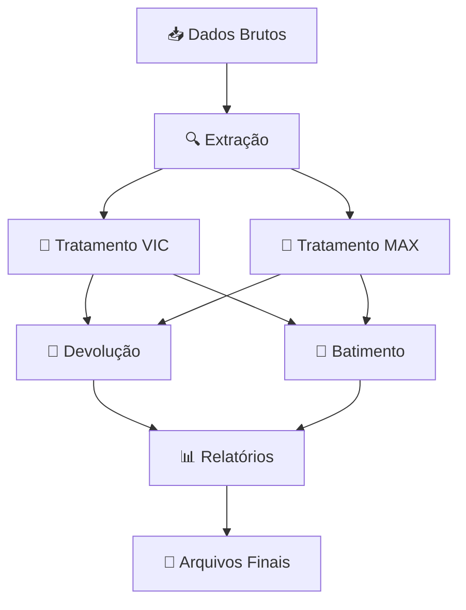

# Pipeline VIC/MAX - Sistema de Processamento de Dados

> **Versão:** 2.0 | **Data:** Outubro 2025 | **Status:** ✅ Produção

Sistema automatizado para processamento, tratamento e cruzamento de dados VIC (Vic Candiotto), MAX (MaxSmart) e Judicial, com estratégia híbrida otimizada para devolução e batimento.

---

## ⚡️ Setup Rápido (Primeira Vez)

```cmd
# 1. Verificar ambiente (9 validações automáticas)
diagnosticar_ambiente.bat

# 2. Configurar projeto (Python + venv + dependências)
setup_project.bat
#    → Se o Python 3.8+ não estiver instalado, o script baixa automaticamente o Python 3.11 portátil

# 3. Configurar credenciais
# Copie env.example para .env e preencha suas credenciais

# 4. Executar pipeline
run_pipeline.bat
#    → Se a venv ainda não existir, o próprio script dispara o setup automaticamente

#    → Os scripts completos (`run_completo.bat` e `run_completo2.0.bat`) também acionam o setup automático antes de rodar

# Escolha opção 2: Pipeline Completo HÍBRIDO ✨ RECOMENDADO
```

> 💡 **Como isso evita o erro "O sistema não pode encontrar o caminho especificado"?**
> 1. `run_pipeline.bat` verifica se existe `venv\Scripts\python.exe`. Se não existir, ele chama o `setup_project.bat --auto` antes de tentar ativar qualquer coisa.
> 2. O `setup_project.bat` instala (quando preciso) um Python portátil 3.11 dentro da pasta `python\`, recria a venv e instala o `requirements.txt`.
> 3. Voltando ao `run_pipeline.bat`, a ativação é feita usando a venv recém-criada — e o script avisa que todo o preparo acabou de ser feito.
> Resultado: mesmo em máquinas onde antes aparecia a mensagem de caminho inexistente, agora o pipeline prepara tudo sozinho e prossegue normalmente.

### 🖥️ Compatível com qualquer Windows (sem pré-requisitos)
- ✅ **Detecta Python existente**: usa automaticamente o `python.exe` encontrado no PATH ou o launcher oficial (`py -3`).
- ✅ **Instala Python portátil quando preciso**: se nenhum intérprete 3.8+ estiver disponível, o `setup_project.bat` baixa e configura um Python 3.11 dedicado dentro da pasta do projeto.
- ✅ **Pipeline auto-recuperável**: ao iniciar, `run_pipeline.bat` garante que o setup automático já rodou, evitando o erro “O sistema não pode encontrar o caminho especificado” nas máquinas novas ou formatadas.

---

## 📚 Documentação Completa

### 📖 Guias de Usuário
- **[docs/INSTALACAO.md](docs/INSTALACAO.md)** - Guia completo de instalação (primeiro uso)
- **[docs/GUIA_RUN_COMPLETO_V2.md](docs/GUIA_RUN_COMPLETO_V2.md)** - Guia visual do fluxo híbrido v2.0
- **[docs/COMPARACAO_RUN_COMPLETO.md](docs/COMPARACAO_RUN_COMPLETO.md)** - Diferença entre v1.0 e v2.0
- **[docs/RESUMO_EXECUTIVO.md](docs/RESUMO_EXECUTIVO.md)** - Principais ganhos e status do projeto

### 🔧 Documentação Técnica
- **[docs/PORTABILIDADE.md](docs/PORTABILIDADE.md)** - Garantia de portabilidade do projeto
- **[docs/PORTABILIDADE_RUN_COMPLETO_V2.md](docs/PORTABILIDADE_RUN_COMPLETO_V2.md)** - Certificado v2.0
- **[docs/ARCHITECTURE_OVERVIEW.md](docs/ARCHITECTURE_OVERVIEW.md)** - Visão geral da arquitetura
- **[docs/FLUXO.md](docs/FLUXO.md)** - Fluxo completo do pipeline

### 🐛 Histórico de Correções
- Registro consolidado internamente (consultar issues ou notas de versão).

### 📋 Especificações dos Processadores
- **[docs/VIC_PROCESSOR.md](docs/VIC_PROCESSOR.md)** - Processador VIC (email)
- **[docs/MAX_PROCESSOR.md](docs/MAX_PROCESSOR.md)** - Processador MAX (DB)
- **[docs/DEVOLUCAO_PROCESSOR.md](docs/DEVOLUCAO_PROCESSOR.md)** - Processador Devolução
- **[docs/BATIMENTO_PROCESSOR.md](docs/BATIMENTO_PROCESSOR.md)** - Processador Batimento

---

## 🚀 Scripts Disponíveis

| Script | Descrição | Quando Usar |
|--------|-----------|-------------|
| `setup_project.bat` | Configuração inicial completa | **Primeira vez** ou após clonar |
| `diagnosticar_ambiente.bat` | Diagnóstico de 9 validações | **Troubleshooting** |
| `run_pipeline.bat` | **Menu interativo** | **Uso diário** (desenvolvimento) |
| `run_completo.bat` | Execução automática v1.0 | Compatibilidade legacy |
| `run_completo2.0.bat` | **✨ Execução híbrida v2.0** | **Produção** (recomendado) |
| `tests\testar_portabilidade.bat` | Valida portabilidade | **QA/Validação** |
| `tests\testar_portabilidade_v2.bat` | Valida v2.0 | **QA/Validação** |

---

## 🎯 Fluxo Híbrido v2.0 (Recomendado)

### Estratégia Otimizada

```
1️⃣ VIC SEM AGING    → 470k registros (para Devolução)
2️⃣ MAX              → 190k registros (compartilhado)
3️⃣ DEVOLUÇÃO        → 2k registros (usa VIC SEM AGING)
4️⃣ VIC COM AGING    → 163k registros (reprocessado para Batimento)
5️⃣ BATIMENTO        → 4k registros (usa VIC COM AGING)
```

### Vantagens do Fluxo Híbrido
✅ **Devolução maximizada:** 470k vs 163k registros (188% mais!)  
✅ **Batimento preciso:** Filtro AGING ≥90 dias para separação judicial  
✅ **Melhor das duas estratégias:** Combina volume com precisão  
✅ **Automatizado:** Zero intervenção manual  

📖 **Detalhes:** [docs/GUIA_RUN_COMPLETO_V2.md](docs/GUIA_RUN_COMPLETO_V2.md)

---

## 🔍 Comparação: v1.0 vs v2.0

| Aspecto | run_completo.bat (v1.0) | run_completo2.0.bat (v2.0) ✨ |
|---------|------------------------|-------------------------------|
| **Estratégia VIC** | VIC COM AGING para tudo | VIC SEM AGING (Devolução) + VIC COM AGING (Batimento) |
| **Registros Devolução** | ~163k | ~470k ⬆️ **188% mais!** |
| **Registros Batimento** | ~4k | ~4k (mesma precisão) |
| **Separação Judicial** | ✅ Correta | ✅ Correta |
| **Tempo Execução** | ~2 minutos | ~3 minutos (+1 min para reprocessar VIC) |
| **Portabilidade** | ✅ 100% | ✅ 100% |
| **Recomendação** | Legacy | **⭐ Produção** |

📖 **Análise completa:** [docs/COMPARACAO_RUN_COMPLETO.md](docs/COMPARACAO_RUN_COMPLETO.md)


## 📋 Visão Geral

Sistema automatizado para processamento de dados VIC, MAX e Judicial:
- Extração, tratamento e cruzamento de dados
- Identificação de devoluções e batimentos
- Geração de relatórios estruturados

## 🏗️ Arquitetura do Sistema

### Estrutura de Diretórios

```
Trabalho/
├── 📄 .gitignore              # Controle de versionamento
├── 📄 README.md               # Documentação principal
├── 📄 config.yaml             # Configurações centralizadas
├── 📄 env.example             # Modelo de credenciais (copiar para .env)
├── 📄 requirements.txt        # Dependências Python
├── 🚀 main.py                 # Orquestrador principal
├── 🚀 run_completo.bat        # Execução completa via script Windows
├── 🚀 run_pipeline.bat        # Launcher Windows com menu interativo
├── 🚀 setup_project.bat       # Configuração automática do ambiente
├── 📁 data/                   # Camada de dados
│   ├── 📁 input/              # Dados brutos de entrada
│   │   ├── 📁 blacklist/      # Coloque listas de bloqueio locais (.gitkeep mantém estrutura)
│   │   ├── 📁 judicial/       # Adicione ClientesJudiciais.zip (não versionado)
│   │   ├── 📁 max/            # Adicione extrações MAX locais (não versionadas)
│   │   └── 📁 vic/            # Adicione extrações VIC locais (não versionadas)
│   ├── 📁 logs/               # Logs gerados localmente (.gitkeep preserva pasta)
│   └── 📁 output/             # Resultados processados (estrutura preservada sem arquivos)
│       ├── 📁 batimento/      # Resultados de batimento VIC vs MAX
│       ├── 📁 comparacoes/    # Relatórios comparativos com legado
│       ├── 📁 devolucao/      # Parcelas para devolução
│       ├── 📁 inconsistencias/# Registros com inconsistências
│       ├── 📁 max_tratada/    # MAX tratado e filtrado
│       └── 📁 vic_tratada/    # VIC tratado e normalizado
├── 📁 docs/                   # Documentação técnica
│   ├── 📄 ARCHITECTURE_OVERVIEW.md
│   ├── 📄 BATIMENTO_PROCESSOR.md
│   ├── 📄 DEVOLUCAO_PROCESSOR.md
│   ├── 📄 LOGS_SPECIFICATION.md
│   ├── 📄 MAX_PROCESSOR.md
│   ├── 📄 README.md
│   ├── 📄 VIC_PROCESSOR.md
│   └── 📄 FLUXO.md
├── 📁 scripts/                # Pontos de entrada e utilitários
│   ├── 🐍 extrair_basemax.py  # Extrator base MAX via SQL
│   ├── 🐍 extrair_email.py    # Extrator VIC via email
│   ├── 🐍 extrair_judicial.py # Extrator base judicial
│   ├── 🐍 pipeline_cli.py     # Interface CLI unificada
│   ├── 🐍 run_full_with_fail.py # Execução completa com validações
│   ├── 🐍 verify_pipeline_outputs.py # Verificações das saídas do pipeline
│   └── 🐍 verify_pipeline_outputs.py # Checagem manual de aging e PROCV
├── 📁 src/                    # Código fonte principal
│   ├── 📁 config/             # Gerenciamento de configurações
│   │   ├── 🐍 __init__.py
│   │   └── 🐍 loader.py
│   ├── 📁 io/                 # Entrada/saída padronizada
│   │   ├── 🐍 __init__.py
│   │   ├── 🐍 file_manager.py
│   │   └── 🐍 packager.py
│   ├── 📁 processors/         # Processadores de domínio
│   │   ├── 🐍 __init__.py
│   │   ├── 🐍 batimento.py
│   │   ├── 🐍 devolucao.py
│   │   ├── 🐍 max.py
│   │   └── 🐍 vic.py
│   └── 📁 utils/              # Utilitários compartilhados
│       ├── 🐍 __init__.py
│       ├── 🐍 aging.py
│       ├── 🐍 anti_join.py
│       ├── 🐍 logger.py
│       ├── 🐍 queries_sql.py
│       ├── 🐍 sql_conn.py
│       ├── 🐍 text.py
│       └── 🐍 validator.py
└── 📁 tests/                  # Testes automatizados
    ├── 🐍 __init__.py
    ├── 🐍 test_aging.py
    ├── 🐍 test_anti_join_outputs.py
    ├── 🐍 test_batimento.py
    ├── 🐍 test_batimento_efficacy.py
    ├── 🐍 test_devolucao.py
    ├── 🐍 test_devolucao_integration.py
    ├── 🐍 test_extraction_failures.py
    └── 🐍 test_proc_v.py
```

### 🔄 Fluxo de Processamento



## 🔧 Pré-requisitos e Instalação

### Requisitos do Sistema

| Componente | Versão Mínima | Descrição |
|------------|---------------|------------|
| **Python** | 3.8+ | Linguagem principal do projeto |
| **ODBC Driver** | 17+ | Conectividade SQL Server |
| **Memória RAM** | 4GB | Processamento de datasets grandes |
| **Espaço em Disco** | 2GB | Armazenamento temporário e logs |
| **Sistema Operacional** | Windows 10+ / Linux | Compatibilidade testada |

### 📦 Instalação Rápida

#### Windows (Recomendado)

```batch
# 1. Clone o repositório
git clone <url-do-repositorio>
cd Trabalho

# 2. Execute o setup automático
setup_project.bat

# 3. Configure as credenciais
# Copie o modelo de exemplo e configure suas credenciais locais (NÃO comitar).
copy env.example .env
# Edite o arquivo .env com suas credenciais (cada desenvolvedor terá seu próprio .env)
```

#### Linux/macOS

```bash
# 1. Clone o repositório
git clone <url-do-repositorio>
cd Trabalho

# 2. Crie o ambiente virtual
python3 -m venv venv
source venv/bin/activate  # Linux/macOS

# 3. Instale as dependências
pip install -r requirements.txt

# (Opcional) Dependências de testes e ferramentas
pip install -r requirements-dev.txt

# 4. Configure as credenciais
cp env.example .env
# Edite o arquivo .env com suas credenciais
```

### 🔑 Configuração de Credenciais

Crie um arquivo `.env` na raiz do projeto a partir do modelo `env.example` com o seguinte conteúdo (exemplo):

```env
# === CONFIGURAÇÕES DE EMAIL ===
EMAIL_USER=seu_email@gmail.com
EMAIL_APP_PASSWORD=sua_senha_de_app_16_digitos

# === SQL SERVER - BASE PADRÃO ===
MSSQL_SERVER_STD=servidor.database.windows.net
MSSQL_DATABASE_STD=nome_do_banco
MSSQL_USER_STD=usuario_sql
MSSQL_PASSWORD_STD=senha_sql

# === SQL SERVER - BASE CANDIOTTO ===
MSSQL_SERVER_CANDIOTTO=servidor_candiotto.database.windows.net
MSSQL_DATABASE_CANDIOTTO=banco_candiotto
MSSQL_USER_CANDIOTTO=usuario_candiotto
MSSQL_PASSWORD_CANDIOTTO=senha_candiotto
```

> ⚠️ **Importante**: O arquivo `.env` contém informações sensíveis e **não deve ser versionado**. Ele já está incluído no `.gitignore`.

Como restaurar / compartilhar configurações sem expor segredos:

- Use `env.example` para registrar apenas as chaves/variáveis necessárias, sem valores sensíveis.
- Nunca commite um `.env` real. Para compartilhar credenciais em equipe, use um cofre de segredos (Vault, GitHub Secrets, Azure KeyVault) ou um canal seguro.
- Se precisar recriar um `.env` localmente, copie `env.example` e preencha as variáveis:

```batch
copy env.example .env
rem # editar .env com um editor de texto
```

Se quiser, posso adicionar instruções para usar GitHub Actions / Secrets mais tarde.

### 🧪 Verificação da Instalação

```bash
# Ative o ambiente virtual
venv\Scripts\activate  # Windows
# source venv/bin/activate  # Linux/macOS

# Teste a CLI
python -m scripts.pipeline_cli --help

# Teste a configuração
python -c "from src.config.loader import load_config; print('✅ Configuração OK')"
```

## Principais Mudanças e Melhorias

1.  **Padronização de Credenciais e Configurações:**
    *   **`.env`:** As credenciais sensíveis (usuários, senhas de banco/email) agora são carregadas de um arquivo `.env` na raiz do projeto. Este arquivo **não é versionado** (`.gitignore`) e deve ser configurado localmente por cada usuário.
    *   **`config.yaml`:** Configurações não sensíveis (caminhos de diretórios, nomes de arquivos de saída, parâmetros de busca) são centralizadas em `config.yaml` na raiz do projeto.
    *   `global.empresa.cnpj`: define o CNPJ do credor utilizado pelos relatórios de Devolução e Batimento.
    *   **`src/config/loader.py`:** Um módulo `loader.py` foi criado para carregar as configurações do `config.yaml` de forma padronizada, garantindo que todos os scripts acessem as mesmas definições.

2.  **Estrutura de Módulos e Reusabilidade:**
    *   **`src/utils/`:** Funções utilitárias e classes de conexão com banco de dados (`sql_conn.py`) e queries SQL (`queries_sql.py`) foram consolidadas neste diretório. Isso evita duplicação de código e promove a reusabilidade.
    *   **Padronização de Imports:** Todos os scripts Python agora utilizam imports relativos ao diretório `src`, como `from src.utils.sql_conn import ...`, garantindo consistência e facilitando a navegação.

3.  **Gerenciamento de Ambiente Virtual:**
    *   **`requirements.txt`:** Todas as dependências Python do projeto estão listadas neste arquivo, permitindo a fácil recriação do ambiente em qualquer máquina.
    *   **`requirements-dev.txt`:** Conjunto adicional voltado a desenvolvimento (pytest e utilitários de QA) para executar a suíte de testes localmente.
    *   **`setup_project.bat`:** Este script automatiza a criação e ativação de um ambiente virtual (`venv`) e a instalação de todas as dependências listadas em `requirements.txt`. Ele garante que o ambiente de desenvolvimento seja isolado e consistente.

4.  **Execução e Interatividade:**
    *   **`run_pipeline.bat`:** Este script foi aprimorado para incluir um menu interativo. Ele ativa automaticamente o ambiente virtual e permite ao usuário escolher qual extrator (MAX, Email, Judicial) deseja executar, ou se prefere executar todos sequencialmente. Isso melhora a usabilidade e o controle sobre o pipeline.
    *   **Execução via `python -m`:** Os utilitários podem ser executados como módulos (`python -m scripts.extrair_basemax`) ou pela CLI unificada (`python -m scripts.pipeline_cli vic`) para melhor compatibilidade com containerização e CI/CD.

5.  **Tratamento de Erros (Fail-Fast):**
    *   Os scripts foram ajustados para falhar rapidamente (`Fail-Fast`) caso credenciais ou configurações essenciais estejam ausentes. Isso evita execuções parciais ou com dados incorretos, fornecendo feedback claro sobre o que precisa ser corrigido.

## 🚀 Guia de Uso

### Execução Automática (Produção) ⭐ **RECOMENDADO**

```cmd
# Execução completa com fluxo híbrido v2.0
run_completo2.0.bat

# OU versão padrão (compatibilidade)
run_completo.bat
```

**O que faz:**
- ✅ Configura ambiente (Python + venv + dependências)
- ✅ Extrai bases (VIC email + MAX DB + Judicial DB)
- ✅ Processa MAX
- ✅ Processa VIC (tratamento único com colunas auxiliares)
- ✅ Executa Devolução (aplicando filtros de inclusão configurados)
- ✅ Executa Batimento (reutilizando a mesma base VIC tratada)
- ✅ Gera resumo completo

**Tempo estimado:** 3-5 minutos (com extração)

---

### Execução via Menu Interativo (Desenvolvimento)

```cmd
# Windows - Menu completo
run_pipeline.bat
```

O menu oferece as seguintes opções:

```
===============================================
   MENU INTERATIVO - PIPELINE VIC/MAX
===============================================

PIPELINES COMPLETOS:
1. Pipeline Completo Padrão (VIC aging para todas as etapas)

PROCESSADORES INDIVIDUAIS:
4. Processar apenas MAX (tratamento)
5. Processar apenas VIC (tratamento com aging configurado)
6. Processar apenas Devolução (usar VIC/MAX tratados mais recentes)
7. Processar apenas Batimento (usar VIC/MAX tratados mais recentes)

OUTROS:
9. Extrair Bases (VIC email, MAX DB, Judicial DB)
A. Ajuda
0. Sair

1. 🔍 Extrair dados VIC (Email)
2. 🔍 Extrair dados MAX (SQL)
3. 🔍 Extrair dados Judicial (SQL)
4. 🧹 Processar VIC
5. 🧹 Processar MAX
6. 🔄 Executar Devolução
7. 🔄 Executar Batimento
8. 🚀 Pipeline Completo (Tudo)
9. ❌ Sair

Escolha uma opção [1-9]:
```

### Execução via CLI (Avançado)

#### Processamento Individual

```bash
# Ativar ambiente virtual
venv\Scripts\activate  # Windows

# Processar VIC
python -m scripts.pipeline_cli vic data/input/vic/VicCandiotto.zip

# Processar MAX
python -m scripts.pipeline_cli max data/input/max/MaxSmart.zip

# Executar devolução
python -m scripts.pipeline_cli devolucao \
    data/output/vic_tratada/VIC_tratada_20240115.zip \
    data/output/max_tratada/MAX_tratada_20240115.zip

# Executar batimento
python -m scripts.pipeline_cli batimento \
    data/output/vic_tratada/VIC_tratada_20240115.zip \
    data/output/max_tratada/MAX_tratada_20240115.zip
```

#### Pipeline Completo

```bash
# Execução sequencial de todo o pipeline
python main.py
```

---

## 📊 Resultados Esperados (Fluxo Híbrido v2.0)

### Volumes de Processamento

| Etapa | Registros Entrada | Registros Saída | Taxa Aproveitamento |
|-------|------------------|-----------------|---------------------|
| **VIC SEM AGING** (Devolução) | 921,560 | ~470,709 | 51.1% |
| **VIC COM AGING** (Batimento) | 921,560 | ~163,122 | 17.7% |
| **MAX Tratado** | 195,459 | ~190,884 | 97.7% |
| **Devolução Final** | - | ~1,979 | 1.63% do MAX filtrado |
| **Batimento Final** | - | ~4,030 | 2.47% do VIC COM AGING |

### Separação Judicial vs Extrajudicial

| Tipo | Registros | Percentual |
|------|-----------|------------|
| **Judicial** | ~1 | 0.02% |
| **Extrajudicial** | ~4,029 | 99.98% |
| **Total** | ~4,030 | 100% |

### Arquivos Gerados

```
data/output/
├── vic_tratada/
│   ├── vic_tratada_20251003_145054.zip (VIC SEM AGING - Devolução)
│   └── vic_tratada_20251003_145111.zip (VIC COM AGING - Batimento)
├── max_tratada/
│   └── max_tratada_20251003_145044.zip
├── devolucao/
│   └── vic_devolucao_20251003_145103.zip (~2k registros)
└── batimento/
    └── vic_batimento_20251003_145115.zip (~4k registros)
```

---

## 📊 Monitoramento de Execução

### Logs em Tempo Real

```cmd
# Acompanhar logs durante execução
Get-Content data\logs\execucao_completa_v2.log -Wait  # Windows PowerShell
type data\logs\pipeline.log  # Windows CMD
```

### Verificação de Resultados

```cmd
# Listar arquivos gerados
ls data/output/*/  # Linux/macOS
dir data\output\*\  # Windows

# Verificar tamanhos dos arquivos
du -sh data/output/*/*.zip  # Linux/macOS
```

### 🔍 Extração de Dados

#### VIC via Email

```bash
# Extração automática do último email
python -m scripts.extrair_email

# Resultado: data/input/vic/VicCandiotto_YYYYMMDD_HHMMSS.zip
```

#### MAX via SQL

```bash
# Extração da base MAX
python -m scripts.extrair_basemax

# Resultado: data/input/max/MaxSmart_YYYYMMDD_HHMMSS.zip
```

#### Judicial via SQL

```bash
# Extração da base judicial
python -m scripts.extrair_judicial

# Resultado: data/input/judicial/ClientesJudiciais_YYYYMMDD_HHMMSS.zip
```

## 📋 Logging e Monitoramento

### Sistema de Logs Estruturado

O sistema utiliza logging estruturado com múltiplos níveis e destinos:

```
data/logs/pipeline.log  # Log completo com timestamps
Console                 # Output limpo para usuário
```

#### Formato de Log

```
2024-01-15 14:30:25 - VIC: Carregando arquivo VicCandiotto.zip
2024-01-15 14:30:26 - VIC: 1.234.567 registros carregados
2024-01-15 14:30:27 - VIC: Filtro STATUS_TITULO=EM ABERTO: 987.654 registros
2024-01-15 14:30:28 - VIC: Aging por cliente: 456.789 clientes válidos
2024-01-15 14:30:29 - VIC: Tratamento concluído - arquivo exportado
```

#### Níveis de Log

| Nível | Uso | Exemplo |
|-------|-----|----------|
| `INFO` | Progresso normal | `VIC: 1.234 registros processados` |
| `WARNING` | Situações inesperadas | `MAX: 45 registros com PARCELA inválida` |
| `ERROR` | Falhas recuperáveis | `Arquivo não encontrado: backup.zip` |
| `CRITICAL` | Falhas fatais | `Conexão SQL falhou após 3 tentativas` |

### 🔍 Troubleshooting

#### Problemas Comuns

**1. Erro de Conexão SQL**
```
ERROR: Falha na conexão com SQL Server
Solução: Verifique credenciais no .env e conectividade de rede
```

**2. Arquivo não encontrado**
```
ERROR: Arquivo VicCandiotto.zip não encontrado
Solução: Execute primeiro a extração via email ou coloque o arquivo manualmente
```

**3. Memória insuficiente**
```
ERROR: MemoryError durante processamento
Solução: Aumente RAM disponível ou processe em lotes menores
```

**4. Credenciais inválidas**
```
ERROR: Falha na autenticação do email
Solução: Verifique EMAIL_APP_PASSWORD no .env (deve ser senha de app, não senha normal)
```

**5. Arquivo VIC não encontrado (run_completo2.0.bat)**
```
ERROR: FileNotFoundError: vic_tratada_YYYYMMDD_HHMMSS.zip
Solução: Este erro foi corrigido na v2.0. Certifique-se de usar run_completo2.0.bat atualizado
```

---

## 🔧 Diagnóstico Automatizado

### Script de Diagnóstico (9 Validações)

```cmd
diagnosticar_ambiente.bat
```

**O que verifica:**
1. ✅ Python instalado (versão ≥3.8)
2. ✅ Ambiente virtual (venv) existe
3. ✅ Dependências instaladas (requirements.txt)
4. ✅ Estrutura de diretórios correta
5. ✅ Arquivo .env existe
6. ✅ config.yaml existe
7. ✅ Arquivo principal (main.py) existe
8. ✅ Arquivos de entrada disponíveis
9. ✅ ODBC Driver instalado

**Resultado esperado:** `✅ 0 erros, 0 avisos`

### Teste de Portabilidade

```cmd
tests\testar_portabilidade.bat     # Testa v1.0
tests\testar_portabilidade_v2.bat  # Testa v2.0
```

Valida que o projeto funciona em qualquer ambiente (sem caminhos hardcoded).

---

## 📚 Documentação Técnica

### Documentos Disponíveis

| Documento | Descrição |
|-----------|------------|
| [`docs/README.md`](docs/README.md) | **Índice oficial da documentação** - Como navegar pelos materiais por perfil |
| [`docs/ARCHITECTURE_OVERVIEW.md`](docs/ARCHITECTURE_OVERVIEW.md) | **Arquitetura completa do sistema** - Visão geral, fluxo de dados e integração |
| [`docs/FLUXO.md`](docs/FLUXO.md) | Fluxo completo e dependências entre as etapas |
| [`docs/VIC_PROCESSOR.md`](docs/VIC_PROCESSOR.md) | **Processador VIC** - Extração email, validações, filtros e normalização |
| [`docs/MAX_PROCESSOR.md`](docs/MAX_PROCESSOR.md) | **Processador MAX** - Dados MaxSmart, validação de parcelas e subsets |
| [`docs/DEVOLUCAO_PROCESSOR.md`](docs/DEVOLUCAO_PROCESSOR.md) | **Processador Devolução** - Cruzamento VIC×MAX e regras de negócio |
| [`docs/BATIMENTO_PROCESSOR.md`](docs/BATIMENTO_PROCESSOR.md) | **Processador Batimento** - Auditoria final, divergências e relatórios |
| [`docs/LOGS_SPECIFICATION.md`](docs/LOGS_SPECIFICATION.md) | Especificação de logs, formato e estrutura |
| [`scripts/verify_pipeline_outputs.py`](scripts/verify_pipeline_outputs.py) | Script para validar manualmente as saídas tratadas |
| [`scripts/verify_pipeline_outputs.py`](scripts/verify_pipeline_outputs.py) | Verifica outputs (MAX/VIC/Devolução/Batimento) e consistência |

### 📊 Cada documento técnico inclui:
- **Fluxo de processamento** detalhado com diagramas Mermaid
- **Estrutura de dados** de entrada e saída
- **Etapas de processamento** com exemplos de código Python
- **Configurações** e parâmetros específicos
- **Métricas** e estatísticas típicas de execução
- **Tratamento de erros** e casos de teste
- **Validações** de integridade e qualidade dos dados

### 🔧 Desenvolvimento e Contribuição

#### Estrutura de Desenvolvimento

```bash
# Setup para desenvolvimento
git clone <repositorio>
cd Trabalho
python -m venv venv
venv\Scripts\activate
pip install -r requirements.txt
# Pacote adicional para rodar a suíte de testes local
pip install -r requirements-dev.txt
```

#### Padrões de Código

- **Idioma**: Português em TODO código, comentários e documentação
- **Formatação**: Black + isort para Python
- **Linting**: flake8 + mypy para qualidade
- **Testes**: pytest para cobertura

#### Workflow de Contribuição

1. **Fork** do repositório
2. **Branch** para feature: `git checkout -b feature/nova-funcionalidade`
3. **Commit** com mensagens descritivas em português
4. **Testes** obrigatórios para novas funcionalidades
5. **Pull Request** com descrição detalhada

#### Executar Testes

```bash
# Testes unitários
pytest tests/

# Testes com cobertura
pytest --cov=src tests/
```

## 🏗️ Arquitetura para Novos Pipelines

### Template de Refatoração

Ao criar novos pipelines baseados neste modelo:

#### 1. Estrutura Base
```bash
# Copie a estrutura base
cp -r Trabalho/ NovoPipeline/
cd NovoPipeline/

# Adapte os processadores
rm src/processors/*
# Crie novos processadores específicos
```

#### 2. Configuração
- **Centralize** todas as configurações em `config.yaml`
- **Isole** credenciais sensíveis em `.env`
- **Valide** configurações no startup (fail-fast)

#### 3. Processadores
- **Um processador** = uma responsabilidade
- **Interface padrão**: função `processar(arquivo_entrada) -> arquivo_saida`
- **Logging estruturado** em todas as etapas

#### 4. Utilitários
- **Reutilize** `src/utils/` sempre que possível
- **Adicione** novos utilitários apenas se necessário
- **Mantenha** compatibilidade com utilitários existentes

#### 5. CLI e Menu
- **Implemente** CLI unificada seguindo o padrão
- **Crie** menu interativo para facilitar uso
- **Documente** todos os comandos disponíveis

---

## ✅ Garantias de Qualidade

### Portabilidade
- ✅ **100% portável** - Funciona em qualquer máquina Windows
- ✅ **Sem caminhos hardcoded** - Usa sempre caminhos relativos
- ✅ **Ambiente isolado** - Venv próprio, sem conflitos
- ✅ **Testado** - Scripts de validação automatizados

### Confiabilidade
- ✅ **Fail-fast** - Falha rápido com mensagens claras
- ✅ **Logs completos** - Rastreabilidade total de execução
- ✅ **Validação de dados** - Checks em todas as etapas
- ✅ **Resumo visual** - Confirmação de arquivos gerados

### Performance
- ✅ **Otimizado** - Processamento eficiente de grandes volumes
- ✅ **Fluxo híbrido** - Melhor estratégia (v2.0)
- ✅ **Tempo previsível** - 3-5 minutos com extração
- ✅ **Recursos controlados** - Uso eficiente de memória

---

## 📦 Entrega do Projeto

### ✅ Checklist de Entrega

#### Código
- ✅ Código-fonte completo em `src/`
- ✅ Scripts de automação em raiz
- ✅ Testes em `tests/`
- ✅ Utilitários em `scripts/`

#### Documentação
- ✅ README.md atualizado (este arquivo)
- ✅ Documentação técnica completa em `docs/`
- ✅ Guias de instalação e uso
- ✅ Histórico de correções e melhorias

#### Configuração
- ✅ `config.yaml` - Configurações centralizadas
- ✅ `env.example` - Modelo de credenciais
- ✅ `requirements.txt` - Dependências Python
- ✅ `.gitignore` - Arquivos não versionados

#### Scripts de Automação
- ✅ `setup_project.bat` - Configuração inicial
- ✅ `diagnosticar_ambiente.bat` - Validação (9 checks)
- ✅ `run_pipeline.bat` - Menu interativo
- ✅ `run_completo2.0.bat` - Execução automática v2.0 ⭐

#### Testes e Validação
- ✅ `tests/testar_portabilidade.bat` - Valida v1.0
- ✅ `tests/testar_portabilidade_v2.bat` - Valida v2.0
- ✅ Testes unitários em `tests/`

### 📊 Estrutura de Entrega

```
Trabalho-3/
├── 📄 README.md                    ← VOCÊ ESTÁ AQUI
├── 📄 config.yaml                  ← Configurações do projeto
├── 📄 env.example                  ← Modelo de credenciais
├── 📄 requirements.txt             ← Dependências Python
├── 📄 .gitignore                   ← Controle de versionamento
│
├── 🚀 main.py                      ← Orquestrador principal
├── 🚀 setup_project.bat            ← Setup inicial
├── 🚀 diagnosticar_ambiente.bat   ← Validação (9 checks)
├── 🚀 run_pipeline.bat             ← Menu interativo
├── 🚀 run_completo.bat             ← Execução v1.0
├── 🚀 run_completo2.0.bat          ← Execução v2.0 ⭐
│
├── 📁 src/                         ← Código-fonte
│   ├── config/                     ← Carregamento de configurações
│   ├── io/                         ← File manager e packager
│   ├── processors/                 ← Processadores (VIC, MAX, etc)
│   └── utils/                      ← Utilitários (SQL, logging, etc)
│
├── 📁 scripts/                     ← Scripts auxiliares
│   ├── extrair_basemax.py          ← Extração MAX
│   ├── extrair_email.py            ← Extração VIC (email)
│   ├── extrair_judicial.py         ← Extração Judicial
│   └── pipeline_cli.py             ← CLI unificada
│
├── 📁 docs/                        ← Documentação técnica completa
│   ├── INSTALACAO.md               ← Guia de instalação
│   ├── PORTABILIDADE.md            ← Garantia de portabilidade
│   ├── GUIA_RUN_COMPLETO_V2.md     ← Guia visual v2.0
│   ├── COMPARACAO_RUN_COMPLETO.md  ← v1.0 vs v2.0
│   ├── ARCHITECTURE_OVERVIEW.md    ← Arquitetura do sistema
│   ├── FLUXO.md                    ← Fluxo completo
│   ├── VIC_PROCESSOR.md            ← Processador VIC
│   ├── MAX_PROCESSOR.md            ← Processador MAX
│   ├── DEVOLUCAO_PROCESSOR.md      ← Processador Devolução
│   ├── BATIMENTO_PROCESSOR.md      ← Processador Batimento
│   └── [outros documentos...]
│
├── 📁 tests/                       ← Testes
│   ├── testar_portabilidade.bat   ← Teste v1.0
│   ├── testar_portabilidade_v2.bat ← Teste v2.0
│   └── test_*.py                   ← Testes unitários
│
├── 📁 data/                        ← Dados (não versionado)
│   ├── input/                      ← Dados de entrada
│   ├── output/                     ← Dados processados
│   └── logs/                       ← Logs de execução
│
└── 📁 venv/                        ← Ambiente virtual (não versionado)
```

### 🎓 Para Começar

1. **Clone o repositório:**
   ```cmd
   git clone https://github.com/Thiagowop/Trabalho.git
   cd Trabalho-3
   ```

2. **Execute o diagnóstico:**
   ```cmd
   diagnosticar_ambiente.bat
   ```

3. **Configure o ambiente:**
   ```cmd
   setup_project.bat
   ```

4. **Configure credenciais:**
   ```cmd
   copy env.example .env
   notepad .env
   ```

5. **Execute o pipeline:**
   ```cmd
   run_completo2.0.bat
   ```

---

## 📞 Suporte e Contato

### Documentação Adicional
- 📖 [Guia de Instalação Completo](docs/INSTALACAO.md)
- 🔧 [Guia de Portabilidade](docs/PORTABILIDADE.md)
- 📌 [Resumo Executivo](docs/RESUMO_EXECUTIVO.md)

### Issues e Melhorias
- Reporte problemas via GitHub Issues
- Sugestões de melhorias são bem-vindas

---

## 📄 Licença e Informações

**Projeto:** Pipeline VIC/MAX - Processamento de Dados  
**Versão:** 2.0  
**Data:** Outubro 2025  
**Status:** ✅ Produção  
**Repositório:** [Thiagowop/Trabalho](https://github.com/Thiagowop/Trabalho)  
**Branch:** ProjetoDti

---

<div align="center">

**✨ Projeto entregue e pronto para produção! ✨**

🚀 Use `run_completo2.0.bat` para melhores resultados 🚀

</div>

