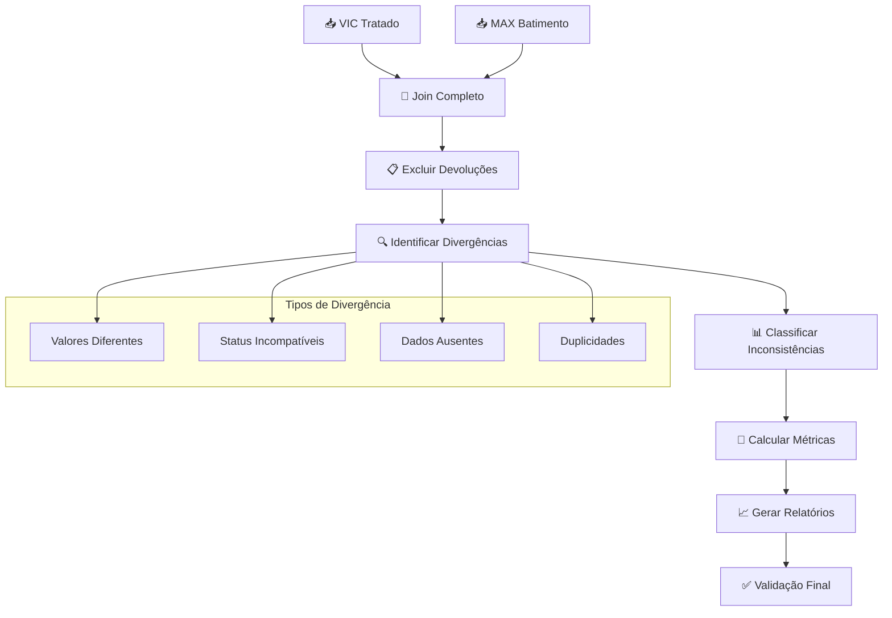

# Processador de Batimento - Documentação Técnica

## 📋 Visão Geral

O **Processador de Batimento** é responsável pela reconciliação final entre dados VIC e MAX, identificando divergências, inconsistências e gerando relatórios de auditoria. Este processador atua como validação final do pipeline, garantindo a integridade dos dados após o processo de devolução.

## 🔄 Fluxo de Processamento



## 📊 Estrutura de Dados

### Dados de Entrada

#### VIC (Entrada Principal)
| Coluna | Tipo | Descrição | Exemplo |
|--------|------|-----------|----------|
| `CHAVE` | String | Chave de join (PARCELA) | `12345-001` |
| `CPF_CNPJ` | String | Documento normalizado | `12345678901` |
| `NOME` | String | Nome do cliente | `João Silva` |
| `STATUS` | String | Status VIC | `EM ABERTO` |
| `VALOR_ORIGINAL` | Float | Valor original da dívida | `2500.00` |
| `DATA_VENCIMENTO` | Date | Data de vencimento | `2024-01-15` |

#### MAX (Entrada Secundária)
| Coluna | Tipo | Descrição | Exemplo |
|--------|------|-----------|----------|
| `PARCELA` | String | Chave de join | `12345-001` |
| `CPF_CNPJ_NORMALIZADO` | String | Documento normalizado | `12345678901` |
| `STATUS` | String | Status MAX | `ATIVO` |
| `CAMPANHA` | String | Campanha ativa | `2024_JAN` |
| `VALOR_DIVIDA` | Float | Valor atual da dívida | `2500.00` |

#### Devoluções (Entrada de Controle)
| Coluna | Tipo | Descrição | Exemplo |
|--------|------|-----------|----------|
| `CHAVE` | String | Parcela devolvida | `12345-001` |
| `MOTIVO_DEVOLUCAO` | String | Razão da devolução | `PAGAMENTO_CONFIRMADO` |

### Dados de Saída

#### Batimento Consolidado
| Coluna | Tipo | Descrição | Origem |
|--------|------|-----------|--------|
| `CHAVE` | String | Identificador único | VIC/MAX |
| `ORIGEM` | String | Fonte do registro | Calculado |
| `STATUS_VIC` | String | Status no VIC | VIC |
| `STATUS_MAX` | String | Status no MAX | MAX |
| `VALOR_VIC` | Float | Valor no VIC | VIC |
| `VALOR_MAX` | Float | Valor no MAX | MAX |
| `DIFERENCA_VALOR` | Float | Diferença entre valores | Calculado |
| `TIPO_DIVERGENCIA` | String | Tipo de inconsistência | Calculado |
| `SEVERIDADE` | String | Nível de criticidade | Calculado |
| `REQUER_ACAO` | Boolean | Necessita intervenção | Calculado |

## 🔧 Etapas Detalhadas

### 1. Carregamento dos Datasets

```python
def carregar_datasets_batimento():
    """
    Carrega todos os datasets necessários para o batimento.
    
    Arquivos esperados:
    - VIC_tratado_*.zip (do processador VIC)
    - MAX_batimento_*.zip (do processador MAX)
    - DEVOLUCOES_*.zip (do processador de devolução)
    
    Validações:
    - Presença de todos os arquivos
    - Consistência temporal (mesmo período)
    - Colunas obrigatórias
    """
    # Localizar arquivos mais recentes
    arquivo_vic = encontrar_arquivo_mais_recente('data/output/vic_tratada', 'VIC_tratado_*.zip')
    arquivo_max = encontrar_arquivo_mais_recente('data/output/max_tratada', 'MAX_batimento_*.zip')
    arquivo_dev = encontrar_arquivo_mais_recente('data/output/devolucao', 'DEVOLUCOES_*.zip')
    
    if not all([arquivo_vic, arquivo_max]):
        raise FileNotFoundError("Arquivos VIC ou MAX não encontrados")
    
    # Carregar datasets
    df_vic = pd.read_csv(arquivo_vic, compression='zip')
    df_max = pd.read_csv(arquivo_max, compression='zip')
    
    # Devoluções são opcionais (pode não existir)
    df_devolucoes = None
    if arquivo_dev:
        df_devolucoes = pd.read_csv(arquivo_dev, compression='zip')
    
    return df_vic, df_max, df_devolucoes
```

**Logs Gerados:**
```
BATIMENTO: Carregando VIC_tratado_20240115_142030.zip
BATIMENTO: 459.339 registros VIC carregados
BATIMENTO: Carregando MAX_batimento_20240115_143025.zip
BATIMENTO: 2.123.450 registros MAX carregados
BATIMENTO: Carregando DEVOLUCOES_20240115_144530.zip
BATIMENTO: 276.890 devoluções carregadas
```

### 2. Join Completo (OUTER JOIN)

```python
def realizar_join_completo(df_vic, df_max, config):
    """
    Realiza join completo (OUTER) entre VIC e MAX.
    
    Diferente da devolução, o batimento usa OUTER JOIN para:
    - Identificar registros apenas no VIC
    - Identificar registros apenas no MAX
    - Comparar registros presentes em ambos
    
    Classificação de origem:
    - 'VIC_ONLY': Apenas no VIC
    - 'MAX_ONLY': Apenas no MAX
    - 'BOTH': Presente em ambos sistemas
    """
    # Realizar outer join
    df_joined = pd.merge(
        df_vic,
        df_max,
        left_on='CHAVE',
        right_on='PARCELA',
        how='outer',
        suffixes=('_VIC', '_MAX'),
        indicator=True
    )
    
    # Classificar origem dos registros
    def classificar_origem(row):
        if row['_merge'] == 'left_only':
            return 'VIC_ONLY'
        elif row['_merge'] == 'right_only':
            return 'MAX_ONLY'
        else:
            return 'BOTH'
    
    df_joined['ORIGEM'] = df_joined.apply(classificar_origem, axis=1)
    df_joined = df_joined.drop('_merge', axis=1)
    
    return df_joined
```

**Logs Gerados:**
```
BATIMENTO: Realizando join completo VIC ⟵⟶ MAX
BATIMENTO: Join tipo 'outer' executado
BATIMENTO: 2.306.099 registros após join
BATIMENTO: VIC_ONLY: 72.105 registros (3.1%)
BATIMENTO: MAX_ONLY: 1.774.655 registros (77.0%)
BATIMENTO: BOTH: 459.339 registros (19.9%)
```

### 3. Exclusão de Devoluções

```python
def excluir_devolucoes(df_joined, df_devolucoes, config):
    """
    Remove registros que foram identificados como devoluções.
    
    Processo:
    1. Identifica parcelas devolvidas
    2. Remove do dataset de batimento
    3. Registra estatísticas de exclusão
    
    Configuração:
    batimento:
      excluir_devolucoes: true
      manter_log_exclusoes: true
    """
    if df_devolucoes is None or not config.get('batimento', {}).get('excluir_devolucoes', True):
        logger.info("BATIMENTO: Exclusão de devoluções desabilitada")
        return df_joined, pd.DataFrame()
    
    # Identificar parcelas devolvidas
    parcelas_devolvidas = set(df_devolucoes['CHAVE'].unique())
    
    # Separar registros excluídos
    mask_devolucoes = df_joined['CHAVE'].isin(parcelas_devolvidas)
    df_excluidos = df_joined[mask_devolucoes].copy()
    df_batimento = df_joined[~mask_devolucoes].copy()
    
    # Adicionar motivo de exclusão
    if len(df_excluidos) > 0:
        df_excluidos = df_excluidos.merge(
            df_devolucoes[['CHAVE', 'MOTIVO_DEVOLUCAO']],
            on='CHAVE',
            how='left'
        )
    
    return df_batimento, df_excluidos
```

**Logs Gerados:**
```
BATIMENTO: Excluindo devoluções do batimento
BATIMENTO: 276.890 parcelas devolvidas identificadas
BATIMENTO: 245.123 registros excluídos do batimento (10.6%)
BATIMENTO: 2.060.976 registros restantes para batimento
```

### 4. Identificação de Divergências

```python
def identificar_divergencias(df_batimento, config):
    """
    Identifica e classifica divergências entre VIC e MAX.
    
    Tipos de divergência:
    1. VALOR_DIFERENTE: Valores não coincidem
    2. STATUS_INCOMPATIVEL: Status incompatíveis
    3. CPF_INCONSISTENTE: CPF/CNPJ diferentes
    4. DADOS_AUSENTES: Informações faltantes
    5. SEM_DIVERGENCIA: Registros consistentes
    
    Configuração de tolerâncias:
    batimento:
      tolerancias:
        valor_absoluta: 0.01  # R$ 0,01
        valor_percentual: 0.1  # 0,1%
        status_compativeis:
          'EM ABERTO': ['ATIVO', 'PENDENTE']
          'VENCIDO': ['ATIVO', 'VENCIDO']
          'PAGO': ['INATIVO', 'PAGO']
    """
    tolerancias = config.get('batimento', {}).get('tolerancias', {})
    
    def classificar_divergencia(row):
        divergencias = []
        
        # Verificar apenas registros presentes em ambos
        if row['ORIGEM'] != 'BOTH':
            if row['ORIGEM'] == 'VIC_ONLY':
                return 'AUSENTE_MAX'
            else:
                return 'AUSENTE_VIC'
        
        # 1. Verificar diferença de valores
        if pd.notna(row['VALOR_ORIGINAL']) and pd.notna(row['VALOR_DIVIDA']):
            diferenca_abs = abs(row['VALOR_ORIGINAL'] - row['VALOR_DIVIDA'])
            diferenca_perc = (diferenca_abs / row['VALOR_ORIGINAL']) * 100
            
            if (diferenca_abs > tolerancias.get('valor_absoluta', 0.01) and 
                diferenca_perc > tolerancias.get('valor_percentual', 0.1)):
                divergencias.append('VALOR_DIFERENTE')
        
        # 2. Verificar compatibilidade de status
        status_compativeis = tolerancias.get('status_compativeis', {})
        status_vic = row['STATUS_VIC']
        status_max = row['STATUS_MAX']
        
        if (status_vic in status_compativeis and 
            status_max not in status_compativeis[status_vic]):
            divergencias.append('STATUS_INCOMPATIVEL')
        
        # 3. Verificar consistência de CPF
        if (pd.notna(row['CPF_CNPJ']) and pd.notna(row['CPF_CNPJ_NORMALIZADO']) and
            row['CPF_CNPJ'] != row['CPF_CNPJ_NORMALIZADO']):
            divergencias.append('CPF_INCONSISTENTE')
        
        # 4. Verificar dados ausentes críticos
        if pd.isna(row['VALOR_ORIGINAL']) or pd.isna(row['VALOR_DIVIDA']):
            divergencias.append('DADOS_AUSENTES')
        
        # Retornar classificação
        if not divergencias:
            return 'SEM_DIVERGENCIA'
        elif len(divergencias) == 1:
            return divergencias[0]
        else:
            return 'MULTIPLAS_DIVERGENCIAS'
    
    # Aplicar classificação
    df_batimento['TIPO_DIVERGENCIA'] = df_batimento.apply(classificar_divergencia, axis=1)
    
    # Calcular diferenças numéricas
    df_batimento['DIFERENCA_VALOR'] = (
        df_batimento['VALOR_ORIGINAL'].fillna(0) - 
        df_batimento['VALOR_DIVIDA'].fillna(0)
    )
    
    return df_batimento
```

**Logs Gerados:**
```
BATIMENTO: Identificando divergências
BATIMENTO: SEM_DIVERGENCIA: 1.234.567 registros (59.9%)
BATIMENTO: VALOR_DIFERENTE: 456.789 registros (22.2%)
BATIMENTO: STATUS_INCOMPATIVEL: 234.567 registros (11.4%)
BATIMENTO: AUSENTE_VIC: 89.012 registros (4.3%)
BATIMENTO: AUSENTE_MAX: 34.567 registros (1.7%)
BATIMENTO: CPF_INCONSISTENTE: 8.901 registros (0.4%)
BATIMENTO: MULTIPLAS_DIVERGENCIAS: 2.573 registros (0.1%)
```

### 5. Classificação por Severidade

```python
def classificar_severidade(df_batimento, config):
    """
    Classifica divergências por nível de severidade.
    
    Níveis de severidade:
    - CRITICA: Requer ação imediata
    - ALTA: Requer ação em 24h
    - MEDIA: Requer ação em 1 semana
    - BAIXA: Monitoramento apenas
    - INFO: Apenas informativo
    
    Critérios de classificação:
    - Valor envolvido
    - Tipo de divergência
    - Impacto no negócio
    """
    def determinar_severidade(row):
        tipo = row['TIPO_DIVERGENCIA']
        valor = abs(row.get('VALOR_ORIGINAL', 0))
        diferenca = abs(row.get('DIFERENCA_VALOR', 0))
        
        # Critérios críticos
        if tipo in ['MULTIPLAS_DIVERGENCIAS'] or valor > 50000:
            return 'CRITICA'
        
        # Critérios alta severidade
        if (tipo in ['VALOR_DIFERENTE', 'STATUS_INCOMPATIVEL'] and 
            (valor > 10000 or diferenca > 5000)):
            return 'ALTA'
        
        # Critérios média severidade
        if (tipo in ['VALOR_DIFERENTE', 'STATUS_INCOMPATIVEL'] and 
            (valor > 1000 or diferenca > 500)):
            return 'MEDIA'
        
        # Critérios baixa severidade
        if tipo in ['CPF_INCONSISTENTE', 'DADOS_AUSENTES']:
            return 'BAIXA'
        
        # Casos informativos
        if tipo in ['SEM_DIVERGENCIA', 'AUSENTE_VIC', 'AUSENTE_MAX']:
            return 'INFO'
        
        return 'BAIXA'  # Default
    
    df_batimento['SEVERIDADE'] = df_batimento.apply(determinar_severidade, axis=1)
    
    # Determinar se requer ação
    df_batimento['REQUER_ACAO'] = df_batimento['SEVERIDADE'].isin(
        ['CRITICA', 'ALTA', 'MEDIA']
    )
    
    return df_batimento
```

**Logs Gerados:**
```
BATIMENTO: Classificando por severidade
BATIMENTO: CRITICA: 12.345 registros (0.6%)
BATIMENTO: ALTA: 89.012 registros (4.3%)
BATIMENTO: MEDIA: 234.567 registros (11.4%)
BATIMENTO: BAIXA: 456.789 registros (22.2%)
BATIMENTO: INFO: 1.268.263 registros (61.5%)
BATIMENTO: Total que requer ação: 335.924 registros (16.3%)
```

### 6. Análise de Qualidade dos Dados

```python
def analisar_qualidade_dados(df_batimento):
    """
    Gera análise detalhada da qualidade dos dados.
    
    Métricas analisadas:
    - Taxa de match entre sistemas
    - Distribuição de divergências
    - Qualidade por origem (VIC vs MAX)
    - Impacto financeiro das divergências
    - Tendências temporais (se disponível)
    """
    total_registros = len(df_batimento)
    
    # Análise de cobertura
    cobertura = {
        'total_registros': total_registros,
        'vic_only': len(df_batimento[df_batimento['ORIGEM'] == 'VIC_ONLY']),
        'max_only': len(df_batimento[df_batimento['ORIGEM'] == 'MAX_ONLY']),
        'both_systems': len(df_batimento[df_batimento['ORIGEM'] == 'BOTH']),
        'taxa_match': len(df_batimento[df_batimento['ORIGEM'] == 'BOTH']) / total_registros * 100
    }
    
    # Análise de divergências
    divergencias = df_batimento['TIPO_DIVERGENCIA'].value_counts().to_dict()
    
    # Análise de severidade
    severidades = df_batimento['SEVERIDADE'].value_counts().to_dict()
    
    # Impacto financeiro
    impacto_financeiro = {
        'valor_total_vic': df_batimento['VALOR_ORIGINAL'].sum(),
        'valor_total_max': df_batimento['VALOR_DIVIDA'].sum(),
        'diferenca_total': df_batimento['DIFERENCA_VALOR'].sum(),
        'maior_divergencia': df_batimento['DIFERENCA_VALOR'].abs().max(),
        'divergencias_criticas_valor': df_batimento[
            df_batimento['SEVERIDADE'] == 'CRITICA'
        ]['VALOR_ORIGINAL'].sum()
    }
    
    return {
        'cobertura': cobertura,
        'divergencias': divergencias,
        'severidades': severidades,
        'impacto_financeiro': impacto_financeiro
    }
```

**Logs Gerados:**
```
BATIMENTO: Análise de qualidade concluída
BATIMENTO: Taxa de match VIC ⟵⟶ MAX: 19.9%
BATIMENTO: Registros que requerem ação: 335.924 (16.3%)
BATIMENTO: Valor total em divergência crítica: R$ 45.678.901,23
BATIMENTO: Maior divergência individual: R$ 125.000,00
BATIMENTO: Diferença total VIC vs MAX: R$ 234.567.890,12
```

### 7. Geração de Relatórios de Auditoria

```python
def gerar_relatorio_auditoria(df_batimento, metricas, config):
    """
    Gera relatório completo de auditoria do batimento.
    
    Seções do relatório:
    1. Resumo Executivo
    2. Análise de Cobertura
    3. Divergências por Tipo
    4. Análise de Severidade
    5. Impacto Financeiro
    6. Recomendações de Ação
    7. Plano de Correção
    """
    timestamp = datetime.now().strftime('%Y%m%d_%H%M%S')
    
    relatorio = f"""
============================================================
RELATÓRIO DE AUDITORIA - BATIMENTO VIC vs MAX
Data/Hora: {timestamp}
============================================================

1. RESUMO EXECUTIVO
-------------------
Total de registros analisados: {metricas['cobertura']['total_registros']:,}
Taxa de match entre sistemas: {metricas['cobertura']['taxa_match']:.1f}%
Registros que requerem ação: {len(df_batimento[df_batimento['REQUER_ACAO']]):,}
Impacto financeiro total: R$ {metricas['impacto_financeiro']['diferenca_total']:,.2f}

2. ANÁLISE DE COBERTURA
----------------------
Registros apenas no VIC: {metricas['cobertura']['vic_only']:,} ({metricas['cobertura']['vic_only']/metricas['cobertura']['total_registros']*100:.1f}%)
Registros apenas no MAX: {metricas['cobertura']['max_only']:,} ({metricas['cobertura']['max_only']/metricas['cobertura']['total_registros']*100:.1f}%)
Registros em ambos sistemas: {metricas['cobertura']['both_systems']:,} ({metricas['cobertura']['both_systems']/metricas['cobertura']['total_registros']*100:.1f}%)

3. DIVERGÊNCIAS POR TIPO
-----------------------
"""
    
    for tipo, quantidade in metricas['divergencias'].items():
        percentual = (quantidade / metricas['cobertura']['total_registros']) * 100
        relatorio += f"{tipo}: {quantidade:,} ({percentual:.1f}%)\n"
    
    relatorio += f"""

4. ANÁLISE DE SEVERIDADE
-----------------------
"""
    
    for severidade, quantidade in metricas['severidades'].items():
        percentual = (quantidade / metricas['cobertura']['total_registros']) * 100
        relatorio += f"{severidade}: {quantidade:,} ({percentual:.1f}%)\n"
    
    relatorio += f"""

5. IMPACTO FINANCEIRO
--------------------
Valor total VIC: R$ {metricas['impacto_financeiro']['valor_total_vic']:,.2f}
Valor total MAX: R$ {metricas['impacto_financeiro']['valor_total_max']:,.2f}
Diferença total: R$ {metricas['impacto_financeiro']['diferenca_total']:,.2f}
Maior divergência: R$ {metricas['impacto_financeiro']['maior_divergencia']:,.2f}
Valor em risco (crítico): R$ {metricas['impacto_financeiro']['divergencias_criticas_valor']:,.2f}

6. RECOMENDAÇÕES DE AÇÃO
-----------------------
"""
    
    # Adicionar recomendações baseadas nas métricas
    if metricas['cobertura']['taxa_match'] < 50:
        relatorio += "• URGENTE: Taxa de match muito baixa - revisar processo de extração\n"
    
    if metricas['severidades'].get('CRITICA', 0) > 0:
        relatorio += f"• CRÍTICO: {metricas['severidades']['CRITICA']} registros críticos requerem ação imediata\n"
    
    if abs(metricas['impacto_financeiro']['diferenca_total']) > 1000000:
        relatorio += "• FINANCEIRO: Diferença total > R$ 1M - revisar processo de valoração\n"
    
    return relatorio
```

## 📊 Datasets de Saída

### 1. Batimento Consolidado

```python
# Arquivo: batimento_vic_20240115_145530.zip
# Conteúdo: Todos os registros com classificação de divergências
# Arquivos internos: batimento_judicial.csv, batimento_extrajudicial.csv

Colunas principais:
- CHAVE (identificador único)
- ORIGEM (VIC_ONLY, MAX_ONLY, BOTH)
- STATUS_VIC, STATUS_MAX (status em cada sistema)
- VALOR_VIC, VALOR_MAX (valores em cada sistema)
- DIFERENCA_VALOR (diferença calculada)
- TIPO_DIVERGENCIA (classificação da divergência)
- SEVERIDADE (nível de criticidade)
- REQUER_ACAO (flag de ação necessária)
```

### 2. Divergências por Severidade

```python
# Arquivos separados por severidade:
# - BATIMENTO_CRITICA_20240115_145530.csv
# - BATIMENTO_ALTA_20240115_145530.csv
# - BATIMENTO_MEDIA_20240115_145530.csv
# - BATIMENTO_BAIXA_20240115_145530.csv

# Facilita priorização de correções
```

### 3. Registros Excluídos

```python
# Arquivo: BATIMENTO_EXCLUIDOS_20240115_145530.csv
# Conteúdo: Registros excluídos por devolução

Colunas adicionais:
- MOTIVO_DEVOLUCAO (razão da exclusão)
- DATA_EXCLUSAO (timestamp da exclusão)
```

### 4. Relatórios de Auditoria

```python
# Arquivo: RELATORIO_AUDITORIA_20240115_145530.txt
# Conteúdo: Relatório executivo completo

# Arquivo: METRICAS_BATIMENTO_20240115_145530.json
# Conteúdo: Métricas detalhadas em JSON

# Arquivo: DASHBOARD_BATIMENTO_20240115_145530.html
# Conteúdo: Dashboard interativo (se configurado)
```

## 🔧 Configurações

### Parâmetros Configuráveis (config.yaml)

```yaml
batimento:
  join:
    tipo: 'outer'  # Sempre outer para batimento completo
    incluir_metricas_join: true
  
  exclusoes:
    excluir_devolucoes: true
    manter_log_exclusoes: true
  
  tolerancias:
    valor_absoluta: 0.01  # R$ 0,01
    valor_percentual: 0.1  # 0,1%
    status_compativeis:
      'EM ABERTO': ['ATIVO', 'PENDENTE']
      'VENCIDO': ['ATIVO', 'VENCIDO']
      'PAGO': ['INATIVO', 'PAGO']
  
  severidade:
    valor_critico: 50000.0
    valor_alto: 10000.0
    valor_medio: 1000.0
    diferenca_critica: 5000.0
  
  output:
    gerar_por_severidade: true
    incluir_dashboard: false
    formato_relatorio: 'txt'
    incluir_metricas_json: true
    incluir_excluidos: true
```

## 📈 Métricas e Estatísticas

### Resumo de Processamento

```
============================================================
PROCESSAMENTO BATIMENTO - RESUMO FINAL
============================================================

Dados de entrada:
VIC registros:                459.339
MAX registros:              2.123.450
Devoluções:                   276.890

Join completo (OUTER):
Total após join:            2.306.099
VIC_ONLY:                      72.105  (3.1%)
MAX_ONLY:                   1.774.655  (77.0%)
BOTH:                         459.339  (19.9%)

Exclusão de devoluções:
Registros excluídos:          245.123  (10.6%)
Registros para batimento:   2.060.976

Classificação de divergências:
SEM_DIVERGENCIA:            1.234.567  (59.9%)
VALOR_DIFERENTE:              456.789  (22.2%)
STATUS_INCOMPATIVEL:          234.567  (11.4%)
AUSENTE_VIC:                   89.012  (4.3%)
AUSENTE_MAX:                   34.567  (1.7%)
CPF_INCONSISTENTE:              8.901  (0.4%)
MULTIPLAS_DIVERGENCIAS:         2.573  (0.1%)

Classificação por severidade:
CRITICA:                       12.345  (0.6%)
ALTA:                          89.012  (4.3%)
MEDIA:                        234.567  (11.4%)
BAIXA:                        456.789  (22.2%)
INFO:                       1.268.263  (61.5%)

Requer ação:                  335.924  (16.3%)

Impacto financeiro:
Valor total VIC:          R$ 1.234.567.890,12
Valor total MAX:          R$ 2.345.678.901,23
Diferença total:          R$ 1.111.111.011,11
Maior divergência:        R$ 125.000,00
Valor crítico:            R$ 45.678.901,23
============================================================
```

## 🚨 Tratamento de Erros

### Erros Críticos (Param Pipeline)

1. **Datasets de entrada não encontrados**
   ```
   CRITICAL: VIC_tratado_*.zip não encontrado
   Ação: Executar processadores anteriores
   ```

2. **Join sem resultados**
   ```
   CRITICAL: Join VIC ⟵⟶ MAX resultou em 0 registros
   Ação: Verificar compatibilidade dos datasets
   ```

3. **Muitas divergências críticas**
   ```
   CRITICAL: 25.3% dos registros têm severidade CRÍTICA
   Ação: Revisar qualidade dos dados de origem
   ```

### Warnings (Continuam Processamento)

1. **Taxa de match baixa**
   ```
   WARNING: Taxa de match VIC ⟵⟶ MAX: 15.2% (abaixo de 50%)
   Possível causa: Datasets de períodos diferentes
   ```

2. **Muitas inconsistências de CPF**
   ```
   WARNING: 8.7% dos registros têm CPF inconsistente
   Ação: Revisar normalização
   ```

## 🧪 Testes e Validação

### Casos de Teste

```python
def test_join_completo():
    """Testa join completo entre VIC e MAX"""
    df_vic = pd.DataFrame({
        'CHAVE': ['12345-001', '12345-002'],
        'VALOR_ORIGINAL': [1000.0, 2000.0]
    })
    
    df_max = pd.DataFrame({
        'PARCELA': ['12345-001', '12345-003'],
        'VALOR_DIVIDA': [1000.0, 1500.0]
    })
    
    resultado = realizar_join_completo(df_vic, df_max, {})
    
    assert len(resultado) == 3  # Todos os registros
    assert 'VIC_ONLY' in resultado['ORIGEM'].values
    assert 'MAX_ONLY' in resultado['ORIGEM'].values
    assert 'BOTH' in resultado['ORIGEM'].values

def test_classificacao_divergencia():
    """Testa classificação de divergências"""
    df_test = pd.DataFrame({
        'ORIGEM': ['BOTH', 'BOTH', 'VIC_ONLY'],
        'VALOR_ORIGINAL': [1000.0, 1000.0, 2000.0],
        'VALOR_DIVIDA': [1000.0, 1100.0, None],
        'STATUS_VIC': ['EM ABERTO', 'EM ABERTO', 'VENCIDO'],
        'STATUS_MAX': ['ATIVO', 'INATIVO', None]
    })
    
    config = {
        'batimento': {
            'tolerancias': {
                'valor_absoluta': 0.01,
                'valor_percentual': 0.1,
                'status_compativeis': {
                    'EM ABERTO': ['ATIVO']
                }
            }
        }
    }
    
    resultado = identificar_divergencias(df_test, config)
    
    assert resultado.iloc[0]['TIPO_DIVERGENCIA'] == 'SEM_DIVERGENCIA'
    assert resultado.iloc[1]['TIPO_DIVERGENCIA'] == 'VALOR_DIFERENTE'
    assert resultado.iloc[2]['TIPO_DIVERGENCIA'] == 'AUSENTE_MAX'
```

### Validação de Integridade

```python
def validar_integridade_batimento(df_batimento):
    """Valida integridade do batimento final"""
    # Todos os registros devem ter classificação
    assert df_batimento['TIPO_DIVERGENCIA'].notna().all()
    assert df_batimento['SEVERIDADE'].notna().all()
    assert df_batimento['ORIGEM'].notna().all()
    
    # Severidades válidas
    severidades_validas = ['CRITICA', 'ALTA', 'MEDIA', 'BAIXA', 'INFO']
    assert all(df_batimento['SEVERIDADE'].isin(severidades_validas))
    
    # Origens válidas
    origens_validas = ['VIC_ONLY', 'MAX_ONLY', 'BOTH']
    assert all(df_batimento['ORIGEM'].isin(origens_validas))
    
    # Consistência de flags
    criticos = df_batimento[df_batimento['SEVERIDADE'] == 'CRITICA']
    assert all(criticos['REQUER_ACAO'] == True)
```

## 📁 Estrutura de Arquivos de Saída

```
data/output/batimento/
├── batimento_vic_20240115_145530.zip               # Dataset principal (contém: batimento_judicial.csv, batimento_extrajudicial.csv)
├── BATIMENTO_CRITICA_20240115_145530.csv           # Severidade crítica
├── BATIMENTO_ALTA_20240115_145530.csv              # Severidade alta
├── BATIMENTO_MEDIA_20240115_145530.csv             # Severidade média
├── BATIMENTO_BAIXA_20240115_145530.csv             # Severidade baixa
├── BATIMENTO_EXCLUIDOS_20240115_145530.csv         # Registros excluídos
├── RELATORIO_AUDITORIA_20240115_145530.txt         # Relatório executivo
├── METRICAS_BATIMENTO_20240115_145530.json         # Métricas detalhadas
└── DASHBOARD_BATIMENTO_20240115_145530.html        # Dashboard (opcional)
```

## 🔄 Integração Final

### Validação do Pipeline Completo

```python
# O processador de batimento valida:
# 1. Consistência entre todos os processadores
# 2. Integridade dos dados finais
# 3. Qualidade do processo completo
# 4. Métricas de auditoria
```

### Relatório de Conclusão

```python
# Gera relatório final do pipeline:
# - Resumo de todos os processadores
# - Métricas consolidadas
# - Recomendações de melhoria
# - Status de qualidade dos dados
```

Esta documentação fornece uma visão completa do processador de batimento, detalhando toda a lógica de auditoria, validação e reconciliação necessária para garantir a integridade final dos dados do pipeline VIC/MAX.