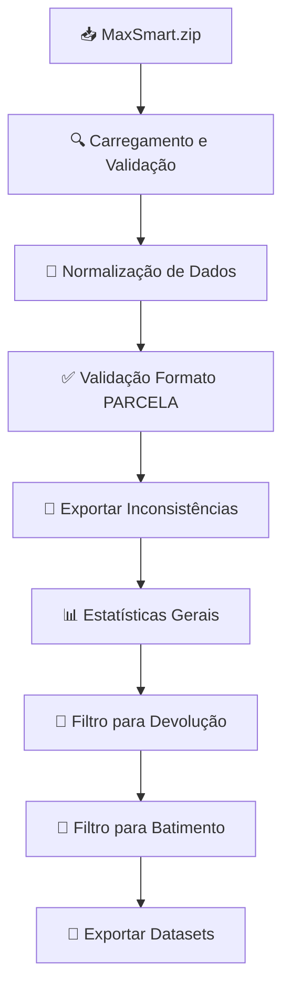

# Processador MAX - Documentação Técnica

## 📋 Visão Geral

O **Processador MAX** é responsável pelo tratamento, validação e normalização dos dados extraídos da base MAX (MaxSmart). Este processador foca na validação rigorosa do formato de parcelas e na preparação de datasets específicos para os processos de devolução e batimento.

## 🔄 Fluxo de Processamento



## 📊 Estrutura de Dados

### Colunas Obrigatórias

| Coluna | Tipo | Descrição | Exemplo |
|--------|------|-----------|----------|
| `PARCELA` | String | Identificador da parcela | `12345-001` |
| `CPF_CNPJ` | String | Documento do cliente | `123.456.789-01` |
| `NOME_CLIENTE` | String | Nome/Razão social | `João Silva` |
| `STATUS` | String | Status da cobrança | `ATIVO` |
| `CAMPANHA` | String | Campanha de cobrança | `2024_JAN` |
| `VALOR_DIVIDA` | Float | Valor total da dívida | `2500.00` |
| `DATA_INCLUSAO` | Date | Data de inclusão no MAX | `2024-01-15` |

### Colunas Calculadas/Normalizadas

| Coluna | Tipo | Descrição | Transformação |
|--------|------|-----------|---------------|
| `CPF_CNPJ_NORMALIZADO` | String | Documento limpo | Remove pontuação |
| `PARCELA_VALIDADA` | Boolean | Parcela com formato válido | Regex validation |

## 🔧 Etapas Detalhadas

### 1. Carregamento e Validação Inicial

```python
def carregar_dados_max(arquivo_zip):
    """
    Carrega dados MAX de arquivo ZIP/CSV com validação inicial.
    
    Validações:
    - Formato de arquivo (ZIP ou CSV)
    - Encoding (UTF-8 com fallback para latin-1)
    - Presença de colunas obrigatórias
    - Estrutura básica do DataFrame
    """
    try:
        if arquivo_zip.endswith('.zip'):
            df = pd.read_csv(arquivo_zip, compression='zip', encoding='utf-8')
        else:
            df = pd.read_csv(arquivo_zip, encoding='utf-8')
    except UnicodeDecodeError:
        # Fallback para latin-1
        df = pd.read_csv(arquivo_zip, encoding='latin-1')
    
    # Validação de colunas obrigatórias
    colunas_obrigatorias = ['PARCELA', 'CPF_CNPJ', 'STATUS', 'CAMPANHA']
    colunas_faltantes = set(colunas_obrigatorias) - set(df.columns)
    
    if colunas_faltantes:
        raise ValueError(f"Colunas obrigatórias ausentes: {colunas_faltantes}")
    
    return df
```

**Logs Gerados:**
```
MAX: Carregando arquivo MaxSmart_20240115.zip
MAX: 2.345.678 registros carregados com sucesso
MAX: Colunas encontradas: PARCELA, CPF_CNPJ, NOME_CLIENTE, STATUS, CAMPANHA, VALOR_DIVIDA
```

### 2. Normalização de Dados

```python
def normalizar_dados_max(df):
    """
    Normaliza dados para processamento consistente.
    
    Normalizações:
    - CPF/CNPJ: remove pontuação
    - Strings: trim e uppercase quando necessário
    - Valores nulos: tratamento específico por coluna
    """
    # Normalizar CPF/CNPJ
    df['CPF_CNPJ_NORMALIZADO'] = df['CPF_CNPJ'].astype(str).str.replace(r'\D', '', regex=True)
    
    # Normalizar strings
    df['STATUS'] = df['STATUS'].astype(str).str.strip().str.upper()
    df['CAMPANHA'] = df['CAMPANHA'].astype(str).str.strip().str.upper()
    
    # Tratar PARCELA
    df['PARCELA'] = df['PARCELA'].astype(str).str.strip()
    
    return df
```

**Exemplo de Transformação:**
```
Antes: CPF_CNPJ = '123.456.789-01', STATUS = ' ativo '
Depois: CPF_CNPJ_NORMALIZADO = '12345678901', STATUS = 'ATIVO'
```

### 3. Validação de Formato de PARCELA

```python
def validar_formato_parcela(df):
    """
    Valida formato da coluna PARCELA usando regex.
    
    Formatos aceitos:
    - XXXXX-XXX (5 dígitos, hífen, 3 dígitos)
    - XXXXXX-XX (6 dígitos, hífen, 2 dígitos)
    - Variações com zeros à esquerda
    
    Exemplos válidos:
    - 12345-001
    - 123456-01
    - 00123-001
    
    Exemplos inválidos:
    - 12345001 (sem hífen)
    - 123-45 (formato incorreto)
    - ABC123-001 (letras)
    """
    import re
    
    # Padrão regex para validação
    padrao_parcela = r'^\d{4,6}-\d{2,3}$'
    
    # Aplicar validação
    df['PARCELA_VALIDADA'] = df['PARCELA'].str.match(padrao_parcela, na=False)
    
    # Separar válidas e inválidas
    df_validas = df[df['PARCELA_VALIDADA']].copy()
    df_invalidas = df[~df['PARCELA_VALIDADA']].copy()
    
    return df_validas, df_invalidas
```

**Logs Gerados:**
```
MAX: Validação formato PARCELA
MAX: 2.298.456 parcelas com formato válido (98.0%)
MAX: 47.222 parcelas com formato inválido (2.0%)
MAX: Exemplos inválidos: ['12345001', 'ABC-123', '123-4567']
```

### 4. Análise de Qualidade dos Dados

```python
def analisar_qualidade_dados(df):
    """
    Gera estatísticas de qualidade dos dados.
    
    Métricas analisadas:
    - Distribuição por STATUS
    - Distribuição por CAMPANHA
    - Valores nulos por coluna
    - Duplicatas de PARCELA
    - Estatísticas de VALOR_DIVIDA
    """
    estatisticas = {
        'total_registros': len(df),
        'distribuicao_status': df['STATUS'].value_counts().to_dict(),
        'distribuicao_campanha': df['CAMPANHA'].value_counts().to_dict(),
        'valores_nulos': df.isnull().sum().to_dict(),
        'duplicatas_parcela': df['PARCELA'].duplicated().sum(),
        'valor_divida_stats': {
            'media': df['VALOR_DIVIDA'].mean(),
            'mediana': df['VALOR_DIVIDA'].median(),
            'total': df['VALOR_DIVIDA'].sum()
        }
    }
    
    return estatisticas
```

**Logs Gerados:**
```
MAX: Análise de qualidade concluída
MAX: Distribuição STATUS - ATIVO: 1.856.234 (80.8%), INATIVO: 442.222 (19.2%)
MAX: Distribuição CAMPANHA - 2024_JAN: 1.234.567, 2023_DEZ: 987.654, OUTROS: 76.235
MAX: Duplicatas PARCELA: 1.234 registros (0.05%)
MAX: Valor médio dívida: R$ 2.456,78
```

### 5. Preparação para Devolução

```python
def preparar_para_devolucao(df, config):
    """
    Filtra dados MAX para processo de devolução.
    
    Filtros aplicados:
    1. STATUS em lista configurada (ex: ['ATIVO'])
    2. CAMPANHA contém termo específico (ex: '2024')
    3. Remove registros com VALOR_DIVIDA <= 0
    
    Configuração (config.yaml):
    max:
      devolucao:
        status_aceitos: ['ATIVO']
        campanha_termo: '2024'
        valor_minimo: 0.01
    """
    # Aplicar filtros
    mask_status = df['STATUS'].isin(config['max']['devolucao']['status_aceitos'])
    mask_campanha = df['CAMPANHA'].str.contains(
        config['max']['devolucao']['campanha_termo'], 
        na=False
    )
    mask_valor = df['VALOR_DIVIDA'] > config['max']['devolucao']['valor_minimo']
    
    df_devolucao = df[mask_status & mask_campanha & mask_valor].copy()
    
    return df_devolucao
```

**Logs Gerados:**
```
MAX: Preparando dataset para devolução
MAX: Filtro STATUS=ATIVO: 1.856.234 registros mantidos
MAX: Filtro CAMPANHA contém '2024': 1.234.567 registros mantidos
MAX: Filtro VALOR_DIVIDA > 0.01: 1.234.560 registros mantidos
MAX: Dataset devolução: 1.234.560 registros
```

### 6. Preparação para Batimento

```python
def preparar_para_batimento(df, config):
    """
    Filtra dados MAX para processo de batimento.
    
    Filtros aplicados:
    1. STATUS em lista configurada (ex: ['ATIVO', 'PENDENTE'])
    2. Sem filtro de campanha (mais abrangente que devolução)
    3. Remove registros com VALOR_DIVIDA <= 0
    
    Diferença da devolução:
    - Critérios mais amplos
    - Inclui campanhas antigas
    - Pode incluir status adicionais
    """
    # Aplicar filtros (mais permissivos que devolução)
    mask_status = df['STATUS'].isin(config['max']['batimento']['status_aceitos'])
    mask_valor = df['VALOR_DIVIDA'] > config['max']['batimento']['valor_minimo']
    
    df_batimento = df[mask_status & mask_valor].copy()
    
    return df_batimento
```

**Logs Gerados:**
```
MAX: Preparando dataset para batimento
MAX: Filtro STATUS em ['ATIVO', 'PENDENTE']: 2.123.456 registros mantidos
MAX: Filtro VALOR_DIVIDA > 0.01: 2.123.450 registros mantidos
MAX: Dataset batimento: 2.123.450 registros
```

## 📊 Datasets de Saída

### 1. MAX Tratado (Completo)

```python
# Arquivo: MAX_tratada_20240115_143025.zip
# Conteúdo: Todos os registros válidos após validação de PARCELA

Colunas:
- PARCELA
- CPF_CNPJ_NORMALIZADO
- NOME_CLIENTE
- STATUS
- CAMPANHA
- VALOR_DIVIDA
- DATA_INCLUSAO
```

### 2. MAX para Devolução

```python
# Arquivo: MAX_devolucao_20240115_143025.zip
# Conteúdo: Subset filtrado para processo de devolução

Filtros aplicados:
- STATUS = 'ATIVO'
- CAMPANHA contém '2024'
- VALOR_DIVIDA > 0.01
```

### 3. MAX para Batimento

```python
# Arquivo: MAX_batimento_20240115_143025.zip
# Conteúdo: Subset filtrado para processo de batimento

Filtros aplicados:
- STATUS in ['ATIVO', 'PENDENTE']
- VALOR_DIVIDA > 0.01
```

### 4. Inconsistências

```python
# Arquivo: MAX_inconsistencias_20240115_143025.csv
# Conteúdo: Registros com PARCELA inválida

Colunas adicionais:
- MOTIVO_INCONSISTENCIA
- PARCELA_ORIGINAL
```

## 🔧 Configurações

### Parâmetros Configuráveis (config.yaml)

```yaml
max:
  validacao:
    regex_parcela: '^\\d{4,6}-\\d{2,3}$'
    max_inconsistencias_percent: 5.0
  
  devolucao:
    status_aceitos: ['ATIVO']
    campanha_termo: '2024'
    valor_minimo: 0.01
  
  batimento:
    status_aceitos: ['ATIVO', 'PENDENTE']
    valor_minimo: 0.01
  
  output:
    incluir_inconsistencias: true
    gerar_estatisticas: true
    formato_data: '%Y%m%d_%H%M%S'
```

## 📈 Métricas e Estatísticas

### Resumo de Processamento

```
============================================================
TRATAMENTO MAX - RESUMO FINAL
============================================================

Registros iniciais:           2.345.678
Parcelas formato inválido:       47.222  (2.0%)
Registros válidos:            2.298.456  (98.0%)

Datasets gerados:
- MAX completo:               2.298.456  (100%)
- MAX devolução:              1.234.560  (53.7%)
- MAX batimento:              2.123.450  (92.4%)

Distribuição por STATUS:
- ATIVO:                      1.856.234  (80.8%)
- PENDENTE:                     267.216  (11.6%)
- INATIVO:                      175.006  (7.6%)

Distribuição por CAMPANHA:
- 2024_JAN:                   1.234.567  (53.7%)
- 2023_DEZ:                     987.654  (43.0%)
- OUTRAS:                        76.235  (3.3%)

Valor total das dívidas:      R$ 5.678.901.234,56
Valor médio por parcela:      R$ 2.470,15
============================================================
```

### Estatísticas Detalhadas (JSON)

```json
{
  "processamento": {
    "timestamp": "2024-01-15T14:30:25",
    "arquivo_origem": "MaxSmart_20240115.zip",
    "registros_iniciais": 2345678,
    "registros_finais": 2298456,
    "taxa_aproveitamento": 98.0
  },
  "validacao": {
    "parcelas_validas": 2298456,
    "parcelas_invalidas": 47222,
    "exemplos_invalidos": [
      "12345001",
      "ABC-123",
      "123-4567"
    ]
  },
  "distribuicoes": {
    "status": {
      "ATIVO": 1856234,
      "PENDENTE": 267216,
      "INATIVO": 175006
    },
    "campanha": {
      "2024_JAN": 1234567,
      "2023_DEZ": 987654,
      "OUTRAS": 76235
    }
  },
  "valores": {
    "total_dividas": 5678901234.56,
    "valor_medio": 2470.15,
    "valor_mediano": 1850.00,
    "maior_divida": 125000.00,
    "menor_divida": 0.01
  }
}
```

## 🚨 Tratamento de Erros

### Erros Críticos (Param Pipeline)

1. **Arquivo não encontrado**
   ```
   CRITICAL: Arquivo MaxSmart.zip não encontrado em data/input/max/
   Ação: Verificar extração via SQL ou colocar arquivo manualmente
   ```

2. **Colunas obrigatórias ausentes**
   ```
   CRITICAL: Colunas obrigatórias não encontradas: ['PARCELA', 'STATUS']
   Ação: Verificar estrutura do arquivo de entrada
   ```

3. **Alto percentual de inconsistências**
   ```
   CRITICAL: 15.2% de parcelas inválidas (acima do limite de 5%)
   Ação: Revisar qualidade dos dados de origem
   ```

### Warnings (Continuam Processamento)

1. **Duplicatas de PARCELA**
   ```
   WARNING: 1.234 parcelas duplicadas encontradas (0.05%)
   Ação: Primeira ocorrência mantida, demais removidas
   ```

2. **Valores de dívida zerados**
   ```
   WARNING: 456 registros com VALOR_DIVIDA <= 0 removidos
   ```

## 🧪 Testes e Validação

### Casos de Teste

```python
def test_validacao_parcela():
    """Testa validação de formato de parcela"""
    df_input = pd.DataFrame({
        'PARCELA': ['12345-001', '123456-01', '12345001', 'ABC-123']
    })
    df_validas, df_invalidas = validar_formato_parcela(df_input)
    
    assert len(df_validas) == 2
    assert len(df_invalidas) == 2
    assert '12345-001' in df_validas['PARCELA'].values
    assert '12345001' in df_invalidas['PARCELA'].values

def test_filtro_devolucao():
    """Testa filtros para devolução"""
    df_input = pd.DataFrame({
        'STATUS': ['ATIVO', 'INATIVO', 'ATIVO'],
        'CAMPANHA': ['2024_JAN', '2023_DEZ', '2024_FEV'],
        'VALOR_DIVIDA': [100.0, 200.0, 0.0]
    })
    
    config = {
        'max': {
            'devolucao': {
                'status_aceitos': ['ATIVO'],
                'campanha_termo': '2024',
                'valor_minimo': 0.01
            }
        }
    }
    
    resultado = preparar_para_devolucao(df_input, config)
    assert len(resultado) == 1  # Apenas primeiro registro
```

### Validação de Integridade

```python
def validar_integridade_max(df_final):
    """Valida integridade dos dados MAX finais"""
    # Formato de parcela válido
    padrao = r'^\d{4,6}-\d{2,3}$'
    assert all(df_final['PARCELA'].str.match(padrao, na=False))
    
    # CPF/CNPJ normalizado
    assert all(df_final['CPF_CNPJ_NORMALIZADO'].str.match(r'^\d+$', na=False))
    
    # Status válidos
    status_validos = ['ATIVO', 'PENDENTE', 'INATIVO']
    assert all(df_final['STATUS'].isin(status_validos))
    
    # Valores positivos
    assert all(df_final['VALOR_DIVIDA'] > 0)
```

## 📁 Estrutura de Arquivos de Saída

```
data/output/max_tratada/
├── MAX_tratada_20240115_143025.zip          # Dataset principal
├── MAX_devolucao_20240115_143025.zip        # Filtrado para devolução
├── MAX_batimento_20240115_143025.zip        # Filtrado para batimento
├── MAX_inconsistencias_20240115_143025.csv  # Parcelas inválidas
└── MAX_estatisticas_20240115_143025.json    # Métricas detalhadas
```

## 🔄 Integração com Outros Processadores

### Interface com Devolução

```python
# O processador de devolução espera:
# - Arquivo MAX_devolucao_*.zip
# - Coluna PARCELA com formato validado
# - Registros filtrados por campanha e status
```

### Interface com Batimento

```python
# O processador de batimento espera:
# - Arquivo MAX_batimento_*.zip
# - Coluna PARCELA para join com VIC.CHAVE
# - Critérios mais amplos que devolução
```

Esta documentação fornece uma visão completa do processador MAX, detalhando todas as validações, transformações e preparações de dados necessárias para os processos subsequentes do pipeline.