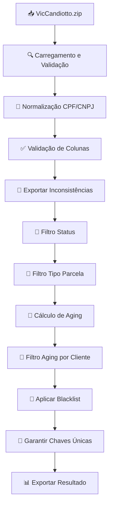

# Processador VIC - Documentação Técnica

## 📋 Visão Geral

O **Processador VIC** é responsável pelo tratamento, normalização e filtragem dos dados extraídos da base VIC (Candiotto). Este processador implementa uma série de filtros sequenciais e validações rigorosas para garantir a qualidade e consistência dos dados de saída.

## 🔄 Fluxo de Processamento



## 📊 Estrutura de Dados

### Colunas Obrigatórias

| Coluna | Tipo | Descrição | Exemplo |
|--------|------|-----------|----------|
| `CHAVE` | String | Identificador único (contrato-parcela) | `12345-001` |
| `CPF_CNPJ` | String | Documento do cliente | `12345678901` |
| `NOME_CLIENTE` | String | Nome/Razão social | `João Silva` |
| `STATUS_TITULO` | String | Status da parcela | `EM ABERTO` |
| `TIPO_PARCELA` | String | Tipo da parcela | `PROSOLUTO` |
| `VENCIMENTO` | Date | Data de vencimento | `2024-01-15` |
| `VALOR_PARCELA` | Float | Valor da parcela | `1500.00` |

### Colunas Calculadas

| Coluna | Tipo | Descrição | Fórmula |
|--------|------|-----------|----------|
| `AGING_DIAS` | Integer | Dias em atraso | `hoje - VENCIMENTO` |
| `CPF_CNPJ_NORMALIZADO` | String | Documento limpo | `re.sub(r'\D', '', CPF_CNPJ)` |

## 🔧 Etapas Detalhadas

### 1. Carregamento e Validação Inicial

```python
def carregar_dados_vic(arquivo_zip):
    """
    Carrega dados VIC de arquivo ZIP/CSV com validação inicial.
    
    Validações:
    - Formato de arquivo (ZIP ou CSV)
    - Encoding (UTF-8 com fallback para latin-1)
    - Estrutura básica do DataFrame
    """
    # Implementação com tratamento de erros
    # Logs: quantidade de registros carregados
```

**Logs Gerados:**
```
VIC: Carregando arquivo VicCandiotto_20240115.zip
VIC: 1.234.567 registros carregados com sucesso
```

### 2. Normalização de CPF/CNPJ

```python
def normalizar_cpf_cnpj(df):
    """
    Remove caracteres não numéricos de CPF/CNPJ.
    
    Transformações:
    - '123.456.789-01' -> '12345678901'
    - '12.345.678/0001-90' -> '12345678000190'
    - Valores nulos mantidos como NaN
    """
    df['CPF_CNPJ_NORMALIZADO'] = df['CPF_CNPJ'].str.replace(r'\D', '', regex=True)
    return df
```

**Exemplo de Transformação:**
```
Antes: CPF_CNPJ = '123.456.789-01'
Depois: CPF_CNPJ_NORMALIZADO = '12345678901'
```

### 3. Validação de Colunas Obrigatórias

```python
def validar_colunas_obrigatorias(df):
    """
    Valida presença e qualidade das colunas obrigatórias.
    
    Validações por coluna:
    - CHAVE: não nulo, formato válido
    - CPF_CNPJ: não nulo, apenas dígitos após normalização
    - VENCIMENTO: formato de data válido
    - VALOR_PARCELA: numérico positivo
    """
    inconsistencias = []
    
    # Validação CHAVE
    mask_chave_invalida = df['CHAVE'].isnull() | (df['CHAVE'] == '')
    inconsistencias.extend(df[mask_chave_invalida])
    
    # Validação CPF/CNPJ
    mask_cpf_invalido = df['CPF_CNPJ_NORMALIZADO'].isnull() | \
                       ~df['CPF_CNPJ_NORMALIZADO'].str.match(r'^\d+$')
    inconsistencias.extend(df[mask_cpf_invalido])
    
    return df[~(mask_chave_invalida | mask_cpf_invalido)], inconsistencias
```

**Logs Gerados:**
```
VIC: Validação concluída - 45.678 inconsistências encontradas
VIC: 1.188.889 registros válidos para processamento
```

### 4. Filtro de Status

```python
def filtrar_por_status(df):
    """
    Mantém apenas parcelas com STATUS_TITULO = 'EM ABERTO'.
    
    Critério:
    - Exato: STATUS_TITULO == 'EM ABERTO'
    - Case-sensitive
    - Remove espaços extras: strip()
    """
    df['STATUS_TITULO'] = df['STATUS_TITULO'].str.strip()
    mask_status = df['STATUS_TITULO'] == 'EM ABERTO'
    
    return df[mask_status]
```

**Logs Gerados:**
```
VIC: Filtro STATUS_TITULO=EM ABERTO: 987.654 registros mantidos
VIC: Removidos 201.235 registros com outros status
```

### 5. Filtro de Tipo de Parcela

```python
def filtrar_por_tipo_parcela(df):
    """
    Mantém apenas tipos específicos de parcela.
    
    Tipos aceitos:
    - PROSOLUTO
    - ITBI  
    - EVOLUCAO DE OBRA
    """
    tipos_validos = ['PROSOLUTO', 'ITBI', 'EVOLUCAO DE OBRA']
    df['TIPO_PARCELA'] = df['TIPO_PARCELA'].str.strip().str.upper()
    mask_tipo = df['TIPO_PARCELA'].isin(tipos_validos)
    
    return df[mask_tipo]
```

**Logs Gerados:**
```
VIC: Filtro TIPO_PARCELA: 856.432 registros mantidos
VIC: Tipos aceitos: PROSOLUTO (645.123), ITBI (156.789), EVOLUCAO DE OBRA (54.520)
```

### 6. Cálculo de Aging

```python
def calcular_aging(df):
    """
    Calcula dias de atraso baseado na data de vencimento.
    
    Fórmula:
    AGING_DIAS = (data_atual - VENCIMENTO).days
    
    Tratamento:
    - Datas futuras: aging = 0
    - Datas inválidas: removidas
    """
    from datetime import datetime
    
    hoje = datetime.now().date()
    df['VENCIMENTO'] = pd.to_datetime(df['VENCIMENTO'], errors='coerce').dt.date
    
    # Remove registros com data inválida
    df = df.dropna(subset=['VENCIMENTO'])
    
    # Calcula aging
    df['AGING_DIAS'] = (hoje - df['VENCIMENTO']).dt.days
    df['AGING_DIAS'] = df['AGING_DIAS'].clip(lower=0)  # Não permite aging negativo
    
    return df
```

**Logs Gerados:**
```
VIC: Cálculo de aging concluído
VIC: Aging médio: 145 dias
VIC: Distribuição: 0-30 dias (123.456), 31-90 dias (234.567), >90 dias (498.409)
```

### 7. Filtro de Aging por Cliente

```python
def filtrar_aging_por_cliente(df):
    """
    Mantém apenas clientes que possuem pelo menos uma parcela > 90 dias.
    
    Lógica:
    1. Agrupa por CPF_CNPJ_NORMALIZADO
    2. Verifica se cliente tem max(AGING_DIAS) > 90
    3. Se sim, mantém TODAS as parcelas do cliente
    4. Se não, remove TODAS as parcelas do cliente
    """
    # Identifica clientes com aging > 90 dias
    clientes_aging_90 = df.groupby('CPF_CNPJ_NORMALIZADO')['AGING_DIAS'].max() > 90
    cpfs_validos = clientes_aging_90[clientes_aging_90].index
    
    # Mantém todas as parcelas dos clientes válidos
    mask_cliente_valido = df['CPF_CNPJ_NORMALIZADO'].isin(cpfs_validos)
    
    return df[mask_cliente_valido]
```

**Logs Gerados:**
```
VIC: Filtro aging por cliente (>90 dias)
VIC: 234.567 clientes únicos analisados
VIC: 156.789 clientes mantidos (com parcelas >90 dias)
VIC: 567.890 parcelas mantidas (todas do cliente, não só >90 dias)
```

### 8. Aplicação de Blacklist

```python
def aplicar_blacklist(df, blacklist_dir=None):
    """
    Remove clientes presentes na blacklist.
    
    Fontes da blacklist:
    - Arquivos do diretório configurado (CSV/Excel)
    - Lista configurada no config.yaml
    - Detecção automática de colunas CPF/CNPJ
    
    Suporte a formatos:
    - CSV: leitura padrão
    - Excel (.xlsx): requer openpyxl
    - Detecção automática de colunas com CPF/CNPJ
    
    Matching:
    - Por CPF_CNPJ_NORMALIZADO (exato)
    - Normalização automática (remove caracteres especiais)
    """
    blacklist_clientes = set()
    
    # Carrega blacklist do config
    if hasattr(self, 'blacklist_clientes'):
        blacklist_clientes.update(self.blacklist_clientes)
    
    # Carrega arquivos de blacklist do diretório
    if blacklist_dir and os.path.exists(blacklist_dir):
        for arquivo in os.listdir(blacklist_dir):
            if arquivo.endswith(('.csv', '.xlsx')):
                try:
                    # Lê arquivo (CSV ou Excel)
                    if arquivo.endswith('.xlsx'):
                        df_blacklist = pd.read_excel(os.path.join(blacklist_dir, arquivo))
                    else:
                        df_blacklist = pd.read_csv(os.path.join(blacklist_dir, arquivo))
                    
                    # Busca coluna com CPF/CNPJ
                    coluna_cpf = None
                    for col in df_blacklist.columns:
                        if any(termo in col.upper() for termo in ['CPF', 'CNPJ', 'DOCUMENTO']):
                            coluna_cpf = col
                            break
                    
                    if coluna_cpf:
                        # Normaliza documentos
                        cpfs_arquivo = df_blacklist[coluna_cpf].astype(str)
                        cpfs_normalizados = cpfs_arquivo.str.replace(r'[^0-9]', '', regex=True)
                        blacklist_clientes.update(cpfs_normalizados.dropna())
                        
                except Exception as e:
                    logger.error(f"Erro ao processar arquivo blacklist {arquivo}: {e}")
    
    # Aplica filtro
    if blacklist_clientes:
        df['CPF_CNPJ_NORMALIZADO'] = df['CPF_CNPJ_NORMALIZADO'].astype(str)
        mask_nao_blacklist = ~df['CPF_CNPJ_NORMALIZADO'].isin(blacklist_clientes)
        df_filtrado = df[mask_nao_blacklist]
        
        removidos = len(df) - len(df_filtrado)
        logger.info(f"Blacklist aplicada: {len(blacklist_clientes)} CPFs, {removidos} registros removidos")
        
        return df_filtrado
    
    return df
```

**Logs Gerados:**
```
VIC: Aplicando blacklist
VIC: Blacklist carregada: 1.234 CPFs únicos
VIC: 2.345 registros removidos (clientes blacklistados)
VIC: 565.545 registros mantidos
```

**Dependências:**
- `openpyxl>=3.1.0` para suporte a arquivos Excel

### 9. Garantia de Chaves Únicas

```python
def garantir_chaves_unicas(df):
    """
    Garante que cada CHAVE apareça apenas uma vez.
    
    Estratégia para duplicatas:
    1. Ordena por AGING_DIAS (desc) - prioriza maior aging
    2. Mantém apenas o primeiro registro de cada CHAVE
    3. Exporta duplicatas removidas para auditoria
    """
    # Identifica duplicatas
    duplicatas = df[df.duplicated(subset=['CHAVE'], keep=False)]
    
    # Remove duplicatas mantendo o de maior aging
    df_sorted = df.sort_values(['CHAVE', 'AGING_DIAS'], ascending=[True, False])
    df_unico = df_sorted.drop_duplicates(subset=['CHAVE'], keep='first')
    
    return df_unico, duplicatas
```

**Logs Gerados:**
```
VIC: Verificação de chaves únicas
VIC: 1.234 chaves duplicadas encontradas
VIC: Mantidos registros com maior aging
VIC: 564.311 registros únicos finais
```

## 📊 Métricas e Estatísticas

### Resumo de Processamento

```
============================================================
TRATAMENTO VIC - RESUMO FINAL
============================================================

Registros iniciais:           1.234.567
Inconsistências removidas:       45.678  (3.7%)
Filtro status EM ABERTO:        201.235  (16.3%)
Filtro tipo parcela:            131.222  (10.6%)
Filtro aging por cliente:       288.678  (23.4%)
Blacklist removidos:              2.345  (0.2%)
Duplicatas removidas:             1.234  (0.1%)

Registros finais:             564.311  (45.7% do total)

Distribuição por tipo:
- PROSOLUTO:                  423.234  (75.0%)
- ITBI:                       98.765   (17.5%)
- EVOLUCAO DE OBRA:           42.312   (7.5%)

Aging médio final:            187 dias
Valor total:                  R$ 234.567.890,12
============================================================
```

## 🚨 Tratamento de Erros

### Erros Críticos (Param Pipeline)

1. **Arquivo não encontrado**
   ```
   CRITICAL: Arquivo VicCandiotto.zip não encontrado em data/input/vic/
   Ação: Verificar extração via email ou colocar arquivo manualmente
   ```

2. **Colunas obrigatórias ausentes**
   ```
   CRITICAL: Colunas obrigatórias não encontradas: ['CHAVE', 'STATUS_TITULO']
   Ação: Verificar estrutura do arquivo de entrada
   ```

3. **Dados completamente inválidos**
   ```
   CRITICAL: Nenhum registro válido após validações
   Ação: Revisar critérios de filtro ou qualidade dos dados
   ```

### Warnings (Continuam Processamento)

1. **Alto percentual de inconsistências**
   ```
   WARNING: 15.2% de inconsistências detectadas (acima do limite de 10%)
   ```

2. **Poucos registros após filtros**
   ```
   WARNING: Apenas 12.3% dos registros mantidos após filtros
   ```

## 🔧 Configurações

### Parâmetros Configuráveis (config.yaml)

```yaml
vic:
  filtros:
    status_aceitos: ["EM ABERTO"]
    tipos_parcela_aceitos: ["PROSOLUTO", "ITBI", "EVOLUCAO DE OBRA"]
    aging_minimo_cliente: 90  # dias
  
  validacao:
    max_inconsistencias_percent: 10.0
    min_registros_finais: 1000
  
  blacklist:
    diretorio: "data/input/blacklist"
    aplicar: true
    formatos_suportados: ["csv", "xlsx"]
    deteccao_automatica_colunas: true
  
  output:
    incluir_inconsistencias: true
    incluir_duplicatas: true
    formato_data: "%Y%m%d_%H%M%S"
```

## 📁 Arquivos de Saída

### Estrutura de Output

```
data/output/vic_tratada/
├── VIC_tratada_20240115_143025.zip     # Dados principais
├── VIC_inconsistencias_20240115_143025.csv  # Registros inválidos
├── VIC_duplicatas_20240115_143025.csv       # Chaves duplicadas
└── VIC_estatisticas_20240115_143025.json    # Métricas detalhadas
```

### Conteúdo do Arquivo Principal

```csv
CHAVE,CPF_CNPJ_NORMALIZADO,NOME_CLIENTE,STATUS_TITULO,TIPO_PARCELA,VENCIMENTO,VALOR_PARCELA,AGING_DIAS
12345-001,12345678901,João Silva,EM ABERTO,PROSOLUTO,2023-06-15,1500.00,214
12345-002,12345678901,João Silva,EM ABERTO,PROSOLUTO,2023-08-15,1500.00,153
67890-001,98765432100,Maria Santos,EM ABERTO,ITBI,2023-05-10,2500.00,250
```

## 🧪 Testes e Validação

### Casos de Teste

```python
def test_filtro_status():
    """Testa filtro de status EM ABERTO"""
    df_input = pd.DataFrame({
        'STATUS_TITULO': ['EM ABERTO', 'PAGO', 'EM ABERTO', 'CANCELADO']
    })
    resultado = filtrar_por_status(df_input)
    assert len(resultado) == 2
    assert all(resultado['STATUS_TITULO'] == 'EM ABERTO')

def test_aging_calculation():
    """Testa cálculo de aging"""
    from datetime import datetime, timedelta
    
    hoje = datetime.now().date()
    vencimento_90_dias = hoje - timedelta(days=90)
    
    df_input = pd.DataFrame({
        'VENCIMENTO': [vencimento_90_dias]
    })
    resultado = calcular_aging(df_input)
    assert resultado['AGING_DIAS'].iloc[0] == 90
```

### Validação de Integridade

```python
def validar_integridade_output(df_final):
    """Valida integridade dos dados finais"""
    # Chaves únicas
    assert df_final['CHAVE'].nunique() == len(df_final)
    
    # Apenas status EM ABERTO
    assert all(df_final['STATUS_TITULO'] == 'EM ABERTO')
    
    # Tipos válidos
    tipos_validos = ['PROSOLUTO', 'ITBI', 'EVOLUCAO DE OBRA']
    assert all(df_final['TIPO_PARCELA'].isin(tipos_validos))
    
    # Aging não negativo
    assert all(df_final['AGING_DIAS'] >= 0)
```

Esta documentação fornece uma visão completa e técnica do processador VIC, permitindo que outros desenvolvedores compreendam a lógica, implementem modificações e realizem manutenções com segurança.