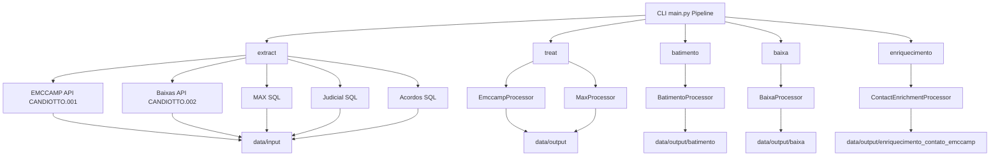

# Fluxo Completo do Projeto EMCCAMP

Este documento resume todas as etapas do pipeline apos a reestruturacao atual. Ele contem:

- Visao de alto nivel das dependencias entre comandos (`extract`, `treat`, `batimento`, `baixa`, `enriquecimento`).
- Regras applied em cada fase (filtros, chaves, deduplicacoes).
- Saidas geradas e onde ficam arquivadas.
- Ordem de execucao usada pelos scripts `.bat`.

---

## Diagrama Geral

---

## Fontes de Dados (Extracoes)

| Dataset | Origem | Script/comando | Observacoes |
|---------|--------|----------------|-------------|
| EMCCAMP | API TOTVS `CANDIOTTO.001` | `python main.py extract emccamp` | Usa `EMCCAMP_DATA_VENCIMENTO_INICIAL` e aging `hoje-6` (quando `EMCCAMP_DATA_VENCIMENTO_FINAL=AUTO`). Salva `data/input/emccamp/Emccamp.zip`. |
| Baixas  | API TOTVS `CANDIOTTO.002` | `python main.py extract baixa` | Filtra `HONORARIO_BAIXADO != 0`, cria coluna `CHAVE = NUM_VENDA-ID_PARCELA`, normaliza datas. Salva `data/input/baixas/baixa_emccamp.zip`. |
| MAX     | SQL Server (STD2016) | `python main.py extract max` | Consulta definida em `src/scripts/extrair_basemax.py`. Salva `data/input/base_max/MaxSmart.zip`. |
| Judicial | SQL Server (AutoJUR + MAX Smart) | `python main.py extract judicial` | Saida `data/input/judicial/ClientesJudiciais.zip`. |
| Acordos | SQL Server (double check) | `python main.py extract doublecheck` | Salva `data/input/doublecheck_acordo/acordos_abertos.zip`. |

---

## Tratamentos

### EMCCAMP (`src/processors/emccamp.py`)
- Renomeia colunas conforme `mappings.emccamp.rename` (`config.yaml`).
- Cria `CHAVE = CONTRATO-PARCELA`.
- Valida obrigatorios: `CONTRATO`, `PARCELA`, `CPF_CNPJ`, `DATA_VENCIMENTO`, `VALOR_PARCELA`.
- Remove duplicadas e vazias; exporta `data/output/emccamp_tratada/emccamp_tratada_<ts>.zip`.
- Inconsistencias sao gravadas em `data/output/inconsistencias/emccamp_inconsistencias_<ts>.zip` (se houver).

### MAX (`src/processors/max.py`)
- Renomeia/strip colunas, cria `CHAVE` a partir de `PARCELA` quando configurado.
- Valida `PARCELA` com regex `^[0-9]{3,}-[0-9]{2,}$` (semaceitos com hifen), remove vazios e duplicados.
- Salva `data/output/max_tratada/max_tratada_<ts>.zip` e inconsistencias correspondentes.

`python main.py treat all` executa as duas rotinas em sequencia.

---

## Batimento (`src/processors/batimento.py`)
- Entrada: `emccamp_tratada` e `max_tratada` mais recentes.
- Filtro opcional (`flags.filtros_batimento`): remove `TIPO_PAGTO` listados em `tipos_excluir` (default `TAXA JUDICIAL`, `HONORARIO COBRANCA`).
- Anti-join `EMCCAMP - MAX` via `procv_emccamp_menos_max` gera os ausentes na MAX.
- Classifica em judicial/extrajudicial usando `data/input/judicial/ClientesJudiciais.zip` (coluna `CPF`).
- Exporta `data/output/batimento/emccamp_batimento_<ts>.zip` com dois CSVs (`*_judicial_*.csv`, `*_extrajudicial_*.csv`).

---

## Baixa (`src/processors/baixa.py`)
- Entrada: `max_tratada` e `emccamp_tratada` mais recentes.
- Filtros configuraveis (`baixa.filtros.max`):
  - `campanhas`: somente `000041 - EMCCAMP`, `000041-EMCCAMP`, `EMCCAMP 41`.
  - `status_titulo`: apenas `ABERTO`.
- Anti-join `MAX - EMCCAMP` via `procv_max_menos_emccamp`.
- Remove CPFs presentes em `data/input/doublecheck_acordo/acordos_abertos.zip` (coluna `CPFCNPJ_CLIENTE`).
- Enriquece com `data/input/baixas/baixa_emccamp.zip` para preencher `DATA_RECEBIMENTO` e `VALOR_RECEBIDO` (merge pela `CHAVE`).
- Divide em `com_recebimento` (ambos campos preenchidos) e `sem_recebimento`.
- Exporta `data/output/baixa/emccamp_baixa_<ts>.zip` contendo `baixa_com_recebimento_<ts>.csv` e `baixa_sem_recebimento_<ts>.csv`.

---

## Enriquecimento de Contato (`src/processors/contact_enrichment.py`)
- Entrada principal: `data/input/emccamp/Emccamp.zip` (definido em `enriquecimento.emccamp_batimento.input`).
- Configuração (`config.yaml::enriquecimento.emccamp_batimento`):
  - `key.components`: `NUM_VENDA` + `ID_PARCELA` para montar `CHAVE`.
  - `filters.key`: lê `data/output/batimento/emccamp_batimento_*.zip` e mantém somente os títulos não batidos.
  - `mapping`: seleciona colunas de contato (CPF, CLIENTE, TELEFONE, EMAIL, VENCIMENTO).
  - `rules`: telefones apenas com dígitos, descarte de e-mails sem `@`, observação “Base Emccamp - DD/MM/AAAA”, `TELEFONE PRINCIPAL = 1`, deduplicação por (`CPFCNPJ CLIENTE`, `CONTATO`, `TIPO`).
- Passos:
  1. Gera `CHAVE` a partir do arquivo bruto e filtra pelas chaves do batimento (judicial + extrajudicial).
  2. Normaliza telefones/e-mails, aplicando as regras acima.
  3. Cria uma linha por contato, ordenando telefones antes de e-mails.
- Saída: `data/output/enriquecimento_contato_emccamp/enriquecimento_contato_emccamp.zip`.

## Saidas Geradas

| Caminho | Conteudo | Responsavel |
|---------|----------|-------------|
| `data/output/emccamp_tratada/` | `emccamp_tratada_<ts>.zip` | `treat emccamp` |
| `data/output/max_tratada/` | `max_tratada_<ts>.zip` + inconsistencias | `treat max` |
| `data/output/batimento/` | `emccamp_batimento_<ts>.zip` (judicial/extrajudicial) | `batimento` |
| `data/output/baixa/` | `emccamp_baixa_<ts>.zip` (`baixa_com_recebimento/baixa_sem_recebimento`) | `baixa` |
| `data/output/enriquecimento_contato_emccamp/` | `enriquecimento_contato_emccamp.zip` | `enriquecimento` |
| `logs/pipeline_emccamp.log` & `data/logs/execucao_emccamp.log` | Logs de execucao | Scripts `.bat` |

---

## Ordem de Execucao (Scripts `.bat`)

### `run_pipeline_emccamp.bat`

1. **Pipeline completo**: extrai todas as bases, trata EMCCAMP & MAX, executa batimento, baixa e enriquecimento.
2. **Sem extracao**: mesma ordem, porem reutilizando arquivos ja extraidos.
3. Opcoes dedicadas: tratamento completo, somente batimento, somente baixa, somente enriquecimento.

### `run_completo_emccamp.bat`

Executa automaticamente: verificar Python -> preparar `venv` -> extrair -> tratar -> batimento -> baixa -> enriquecimento (gravando logs em `data/logs/execucao_emccamp.log`).

---

## Configuracoes Importantes (`config.yaml`)

- `global`: encoding `utf-8-sig`, separador `;`, data ISO (`%Y-%m-%d`).
- `flags.filtros_batimento`: ativa ou desativa o filtro de `TIPO_PAGTO` removido no batimento.
- `baixa`: define campanhas/status aceitos e prefixos de exportacao.
- `enriquecimento.emccamp`: caminho de entrada, colunas mapeadas (`cpf`, `nome`, `telefones`, `emails`), regras de limpeza e nomes dos arquivos de saida.

---

## Objetivos por Etapa

| Etapa | Objetivo | Resultado |
|-------|----------|-----------|
| Extracoes | Coletar fontes oficiais (API/SQL) | ZIPs em `data/input/` |
| Tratamentos | Normalizar e validar EMCCAMP/MAX | Bases tratadas + inconsistencias |
| Batimento | Identificar titulos EMCCAMP ausentes na MAX | `emccamp_batimento_<ts>.zip` |
| Baixa | Filtrar titulos MAX nao reportados e cruzar com baixas/acordos | `emccamp_baixa_<ts>.zip` |
| Enriquecimento | Consolidar contatos para discagens/envio | `enriquecimento_contato_emccamp.zip` |

---

Com este fluxo, qualquer operador consegue entender o encadeamento completo e localizar rapidamente os arquivos gerados em cada fase.
