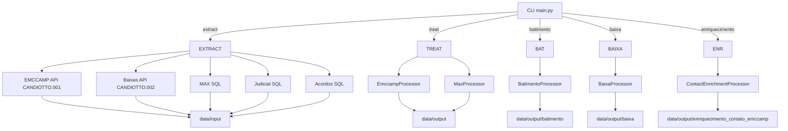

# Relatório Completo do Pipeline EMCCAMP

Este documento consolida, em um único lugar, o fluxograma geral e a descrição detalhada de todas as etapas executadas pelo projeto EMCCAMP (extrações, tratamentos, batimento, baixa e enriquecimento de contato). O objetivo é permitir uma revisão rápida das regras aplicadas, da ordem dos processos e das saídas produzidas, facilitando a identificação de etapas faltantes ou incorretas.

---

## 1. Fluxograma Geral



---

## 2. Extrações

| Dataset | Origem | Comando/Scrip | Regras e Observações | Saída |
|---------|--------|---------------|----------------------|-------|
| EMCCAMP | API TOTVS `CANDIOTTO.001` | `python main.py extract emccamp` | Requer `EMCCAMP_API_URL/USER/PASSWORD`. `EMCCAMP_DATA_VENCIMENTO_INICIAL` obrigatorio. `EMCCAMP_DATA_VENCIMENTO_FINAL=AUTO` ativa aging `hoje - 6` (ou use data fixa do `.env`). | `data/input/emccamp/Emccamp.zip` |
| Baixas  | API TOTVS `CANDIOTTO.002` | `python main.py extract baixa` | Usa `TOTVS_BASE_URL/USER/PASS`. Filtra `HONORARIO_BAIXADO != 0`, cria `CHAVE = NUM_VENDA-ID_PARCELA` e normaliza datas (`YYYY-MM-DD`). | `data/input/baixas/baixa_emccamp.zip` |
| MAX     | SQL Server STD2016 | `python main.py extract max` (usa `src/scripts/extrair_basemax.py`) | Consulta com parâmetros definidos em `config.yaml::queries.max`. | `data/input/base_max/MaxSmart.zip` |
| Judicial | SQL Server (AutoJUR + MAX Smart) | `python main.py extract judicial` | Combina AutoJUR e MAX Smart. | `data/input/judicial/ClientesJudiciais.zip` |
| Acordos | SQL Server (Double Check) | `python main.py extract doublecheck` | Lista CPFs com acordo ativo. | `data/input/doublecheck_acordo/acordos_abertos.zip` |

---

## 3. Tratamentos

### 3.1 EMCCAMP (`src/processors/emccamp.py`)
- Renomeia colunas segundo `config.yaml::mappings.emccamp.rename`.
- Cria `CHAVE = CONTRATO-PARCELA`.
- Valida obrigatórios (`CONTRATO`, `PARCELA`, `CPF_CNPJ`, `DATA_VENCIMENTO`, `VALOR_PARCELA`).
- Elimina duplicatas e linhas vazias.
- Saída: `data/output/emccamp_tratada/emccamp_tratada_<timestamp>.zip`.
- Inconsistências (se houver) -> `data/output/inconsistencias/emccamp_inconsistencias_<timestamp>.zip`.

### 3.2 MAX (`src/processors/max.py`)
- Renomeia/strip colunas.
- Cria `CHAVE` a partir de `PARCELA` quando configurado.
- Regex estrita `^[0-9]{3,}-[0-9]{2,}$` para `PARCELA` (bloqueia formatos incorretos).
- Remove valores vazios ou duplicados.
- Saída: `data/output/max_tratada/max_tratada_<timestamp>.zip`.
- Inconsistências -> `data/output/inconsistencias/max_inconsistencias_<timestamp>.zip`.

### 3.3 Execução conjunta
- `python main.py treat all` roda EMCCAMP e MAX na sequência.

---

## 4. Batimento (`src/processors/batimento.py`)

- Entrada: `emccamp_tratada` e `max_tratada` mais recentes.
- Filtro opcional (`config.yaml::flags.filtros_batimento`): remove `TIPO_PAGTO` em `["TAXA JUDICIAL", "HONORARIO COBRANCA"]`.
- Anti-join `EMCCAMP - MAX` via `procv_emccamp_menos_max`.
- Classificação judicial/extrajudicial com base em `ClientesJudiciais.zip`.
- Saída: `data/output/batimento/emccamp_batimento_<timestamp>.zip` (dois CSVs: judicial e extrajudicial).
- Métricas emitidas via `OutputFormatter` (volumes, taxa de batimento).

---

## 5. Baixa (`src/processors/baixa.py`)

- Entrada: `max_tratada` e `emccamp_tratada`.
- Filtros configuráveis (`config.yaml::baixa.filtros.max`):
  - Campanhas aceitáveis (`000041 - EMCCAMP`, `000041-EMCCAMP`, `EMCCAMP 41`).
  - `STATUS_TITULO = ABERTO`.
- Anti-join `MAX - EMCCAMP` via `procv_max_menos_emccamp`.
- Remove CPFs presentes em `acordos_abertos.zip`.
- Merge com `baixa_emccamp.zip` para preencher `DATA_RECEBIMENTO` / `VALOR_RECEBIDO`.
- Divide em `com_recebimento` (ambos campos preenchidos) e `sem_recebimento`.
- Status fixo (default `98`) e observações definidas no processador.
- Saída: `data/output/baixa/emccamp_baixa_<timestamp>.zip` com:
  - `baixa_com_recebimento_<timestamp>.csv`
  - `baixa_sem_recebimento_<timestamp>.csv`
- Métricas impressas (filtros aplicados, volumes, taxa).

---

## 6. Enriquecimento de Contato (`src/processors/contact_enrichment.py`)

- Configuração (`config.yaml::enriquecimento.emccamp_batimento`):
  - `input.path`: `data/input/emccamp/Emccamp.zip` (mantém colunas de contato originais).
  - `key.components`: `NUM_VENDA` + `ID_PARCELA` -> `CHAVE`.
  - `filters.key`: lê `data/output/batimento/emccamp_batimento_*.zip` e restringe a lista às chaves não encontradas na MAX.
  - `mapping`: CPF (`CPF`), nome (`CLIENTE`), telefones (`TELEFONE`), e-mails (`EMAIL`), data (`VENCIMENTO`).
  - `rules`: limpeza de telefone, descarte de e-mail sem `@`, prefixo `Base Emccamp - DD/MM/AAAA`, `TELEFONE PRINCIPAL = 1`, deduplicação por (`CPFCNPJ CLIENTE`, `CONTATO`, `TIPO`).
- Passos:
  1. Cria `CHAVE = NUM_VENDA-ID_PARCELA`, filtra pelas chaves do batimento (192 títulos judicial + extrajudicial).
  2. Normaliza telefones e e-mails, descartando valores inválidos.
  3. Gera uma linha por contato e ordena telefones antes de e-mails.
- Saída: `data/output/enriquecimento_contato_emccamp/enriquecimento_contato_emccamp.zip` (apenas contatos de títulos não batidos).
- Métricas impressas: linhas de origem, contatos gerados, descartes e deduplicação.


## 7. Orquestração e Scripts

### 7.1 `main.py`
- Comandos disponíveis:
  - `extract {emccamp,max,judicial,baixa,doublecheck,all}`
  - `treat {emccamp,max,all}`
  - `batimento`
  - `baixa`
  - `enriquecimento [--dataset emccamp]`
- Cada comando delega para métodos do `Pipeline`.

### 7.2 `src/pipeline.py`
- Métodos principais:
  - `extract_emccamp/max/judicial/baixa/doublecheck`
  - `treat_emccamp/max/all`
  - `batimento()`
  - `baixa()`
  - `enriquecimento(dataset)`

### 7.3 `run_pipeline_emccamp.bat`
- Menu interativo (ou modo run-once com argumento numérico):
  1. Pipeline completo (extrair -> tratar -> batimento -> baixa -> enriquecimento)
  2. Extrair todas as bases
  3. Pipeline sem extração (tratar -> batimento -> baixa -> enriquecimento)
  4. Tratamento completo (EMCCAMP + MAX)
  5. Somente Batimento
  6. Somente Baixa
  7. Somente Enriquecimento
  8. Sair

### 7.4 `run_completo_emccamp.bat`
- Execução automática (sete passos): verificar Python -> preparar venv -> extrair -> tratar -> batimento -> baixa -> enriquecimento.  
- Registra logs em `data/logs/execucao_emccamp.log`.

---

## 8. Ordem Recomendada de Execução (CLI)

```bash
python main.py extract all
python main.py treat all
python main.py batimento
python main.py baixa
python main.py enriquecimento
```

Os scripts `.bat` aplicam exatamente essa sequência (com inicialização de ambiente).

---

## 9. Saídas e Logs

| Caminho | Conteúdo |
|---------|----------|
| `data/input/` | Arquivos brutos extraídos (EMCCAMP, MAX, judicial, baixas, acordos). |
| `data/output/emccamp_tratada/` | `emccamp_tratada_<timestamp>.zip`. |
| `data/output/max_tratada/` | `max_tratada_<timestamp>.zip` e inconsistências. |
| `data/output/batimento/` | `emccamp_batimento_<timestamp>.zip`. |
| `data/output/baixa/` | `emccamp_baixa_<timestamp>.zip` + CSVs com/sem recebimento. |
| `data/output/enriquecimento_contato_emccamp/` | `enriquecimento_contato_emccamp.zip`. |
| `logs/pipeline_emccamp.log` e `data/logs/execucao_emccamp.log` | Execução do pipeline. |

---

## 10. Regras e Filtros-chave (Resumo)

- **EMCCAMP**: aging `hoje - 6` (quando final = AUTO); `CHAVE = CONTRATO-PARCELA`.  
- **Baixas**: `HONORARIO_BAIXADO != 0`; `CHAVE = NUM_VENDA-ID_PARCELA`.  
- **MAX**: regex `^[0-9]{3,}-[0-9]{2,}$`; remove duplicados/vazios.  
- **Batimento**: filtro opcional `TIPO_PAGTO`; judicial via CPFs judiciais.  
- **Baixa**: campanhas 41 + status `ABERTO`; remove CPFs com acordo; merge com baixas; status fixo `98`.  
- **Enriquecimento**: telefones só dígitos; descarta e-mail sem `@`; deduplica por CPF/contato/tipo; `OBSERVACAO = Base Emccamp - DD/MM/AAAA`; `TELEFONE PRINCIPAL = 1`.

---

## 11. Checklist Operacional

1. Credenciais (.env) disponíveis e rede/vpn ativa.  
2. Espaço em disco suficiente.  
3. Rodar `run_pipeline_emccamp.bat 1` (ou sequência CLI).  
4. Revisar logs (`logs/pipeline_emccamp.log`, `data/logs/execucao_emccamp.log`).  
5. Conferir saídas em `data/output/…` para cada etapa.  
6. Se necessário, rodar apenas sub-etapas via menu (batimento, baixa, enriquecimento).  

---

Com este documento, é possível navegar e auditar o pipeline completo, conferir a ordem das operações, os filtros aplicados e as saídas geradas em cada fase.  Ajustes para novos clientes devem focar nas seções correspondentes do `config.yaml` (principalmente `queries`, `mappings`, `baixa`, `enriquecimento`). 
